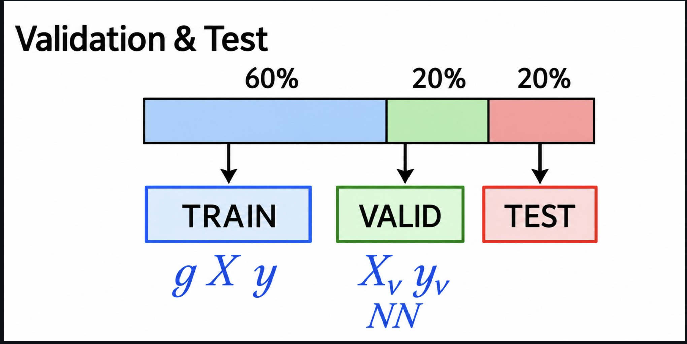

# ML Zoomcamp — Chapter 1: Introduction to Machine Learning

---

## 1.1 Introduction to Machine Learning

📺 [Video](https://www.youtube.com/watch?v=Crm_5n4mvmg&list=PL3MmuxUbc_hIhxl5Ji8t4O6lPAOpHaCLR&index=2) | 🖼️ [Slides](https://www.slideshare.net/AlexeyGrigorev/ml-zoomcamp-11-introduction-to-machine-learning)

### Core idea

The lesson explains ML using a **car price prediction** example.

- The model is trained on historical data made up of two parts:
  - **Features** — information about the object (e.g. `year`, `mileage`, `make`, `condition`, etc.)
  - **Target** — the property we want to predict (e.g. `price`)
- During training, the model **extracts patterns** from the features that explain the target.
- Once trained, the model is given **new data without the target**, and it uses the learned patterns to **predict** the target value.

> **ML = the process of extracting patterns from data**
> - **features** → input info about an object
> - **target** → the thing we want to predict for unseen objects

### Simple mental model

```
Training phase:
   [ Features + Target ]  --->  Model learns patterns

Prediction phase:
   [ Features only ]  --->  Trained Model  --->  Predicted Target
```

**Example — Car price prediction**

| year | mileage | make    | ... | price (target) |
|------|---------|---------|-----|-----------------|
| 2015 | 60,000  | Toyota  | ... | $12,000         |
| 2018 | 30,000  | Honda   | ... | $16,500         |
| 2020 | 10,000  | Ford    | ... | ?  ← model predicts this |

- Rows with a known `price` → used to **train** the model.
- New row without `price` → fed to the trained model to **predict** the price.

### Key takeaway

Machine Learning isn't about hard-coding rules — it's about letting a model **learn patterns from historical examples (features → target)** so it can make predictions on new, unseen data.

---

<!-- Next lesson notes (1.2 ML vs Rule-Based Systems) go below -->

---

## 1.2 ML vs Rule-Based Systems

📺 [Video](https://www.youtube.com/watch?v=CeukwyUdaz8&list=PL3MmuxUbc_hIhxl5Ji8t4O6lPAOpHaCLR&index=3) | 🖼️ [Slides](https://www.slideshare.net/AlexeyGrigorev/ml-zoomcamp-12-ml-vs-rulebased-systems)

### Core idea

Explained using a **spam filter** example.

- **Rule-based systems** flag spam using a fixed set of hand-written characteristics/keywords (e.g. "contains 'lottery'", "sender unknown", email length, etc.).
- Problem: spam patterns keep **changing over time**, so rules need constant updates → the codebase grows, becomes messy, and hard to maintain.
- **ML systems** solve this by learning the patterns from data instead of hard-coding them, so they adapt more easily.

### How ML replaces the rule-based spam filter — 3 steps

**1. Get data**
Use existing emails as examples:
- Emails in the **spam folder** → spam examples
- Emails in the **inbox** → non-spam examples

**2. Define and calculate features**
- The old rules (keywords, length, sender patterns, etc.) become a great **starting point for features**.
- Each email is **encoded** into feature values + a target value:
  - `target = 1` if from the spam folder
  - `target = 0` if from the inbox

**3. Train and use the model**
- An ML algorithm is trained on the encoded emails (features → target).
- The model doesn't output a hard yes/no — it outputs a **probability** that an email is spam.
- To turn that probability into an actual decision, you must pick a **threshold** (e.g. `probability > 0.5 → spam`).

### Rule-based vs ML — quick comparison

| Aspect                  | Rule-Based System                  | Machine Learning System              |
|-------------------------|-------------------------------------|----------------------------------------|
| Logic source            | Manually written rules             | Learned from data                     |
| Adapting to new patterns| Requires manual rule updates       | Retrain model on new data             |
| Maintainability         | Gets complex/messy as rules grow   | Scales better as data grows           |
| Output                  | Hard decision (yes/no)             | Probability → needs a threshold       |

### Simple flow

```
Emails (spam folder + inbox)
        │
        ▼
 Encode → features + target (1 = spam, 0 = not spam)
        │
        ▼
   Train ML model
        │
        ▼
 New email → model outputs P(spam)
        │
        ▼
 Apply threshold (e.g. > 0.5) → final decision: spam / not spam
```

### Key takeaway

ML systems replace brittle, manually-maintained rules with patterns **learned from labeled data (features → target)**, and produce **probabilities** rather than hard rules — which is why a **threshold** is needed to turn a prediction into a decision.

---

<!-- Next lesson notes (1.3 Supervised Machine Learning) go below -->

---

## 1.3 Supervised Machine Learning

📺 [Video](https://www.youtube.com/watch?v=j9kcEuGcC2Y&list=PL3MmuxUbc_hIhxl5Ji8t4O6lPAOpHaCLR&index=4) | 🖼️ [Slides](https://www.slideshare.net/AlexeyGrigorev/ml-zoomcamp-13-supervised-machine-learning)

### Core idea

In **Supervised Machine Learning (SML)**, every training example has **labels** (known targets) attached to its features. The model learns from these labeled examples and then predicts labels for new, unseen features.

- **Feature matrix (X)** — a table of observations/objects (rows) × features (columns).
- **Target variable (y)** — a vector holding the known target value for each row in `X`.
- The model is represented as a function **g** that takes `X` as input and tries to output predictions as close as possible to `y`.
- **Training** = the process of finding that function **g**.

```
        Feature matrix X                Target y
   ┌───────────────────────┐          ┌─────────┐
   │ year | mileage | make │          │  price  │
   │ 2015 |  60,000 |Toyota│   --->   │ 12,000  │
   │ 2018 |  30,000 | Honda│   --->   │ 16,500  │
   │ 2020 |  10,000 |  Ford│   --->   │ 21,000  │
   └───────────────────────┘          └─────────┘

              g(X) ≈ y   ← training finds this function g
```

### Types of SML problems

| Type              | Output                                   | Example                              |
|-------------------|-------------------------------------------|----------------------------------------|
| **Regression**     | A number                                  | Predicting a car's price               |
| **Classification** | A category                                | Spam detection                         |
| — Binary           | 2 categories                              | Spam vs. not spam                      |
| — Multiclass       | More than 2 categories                    | Classifying animal species             |
| **Ranking**        | Top scores associated with items          | Recommender systems (e.g. product/search ranking) |

### Key takeaway

SML is about teaching a model with labeled examples (features → known targets) so it can learn a function **g** that generalizes well — producing predictions on new data that are as close as possible to the true, unseen targets **y**.

---

<!-- Next lesson notes (1.4 CRISP-DM) go below -->

---

## 1.4 CRISP-DM

📺 [Video](https://www.youtube.com/watch?v=dCa3JvmJbr0&list=PL3MmuxUbc_hIhxl5Ji8t4O6lPAOpHaCLR&index=5) | 🖼️ [Slides](https://www.slideshare.net/AlexeyGrigorev/ml-zoomcamp-14-crispdm)

### Core idea

**CRISP-DM** = **Cr**oss-**I**ndustry **S**tandard **P**rocess for **D**ata **M**ining — an open, widely-used process model describing the common steps data mining/ML experts follow on a project. Conceived in 1996, it became a European Union ESPRIT project in 1997, led by five companies (ISL, Teradata, Daimler AG, NCR, and OHRA insurance).

### The 6 steps


```
1. Business Understanding
        │  (Do we even need ML? Define a measurable goal)
        ▼
2. Data Understanding
        │  (What data exists? Do we need more?)
        ▼
3. Data Preparation
        │  (Clean data, remove noise, build pipelines,
        │   convert to tabular format for ML)
        ▼
4. Modeling
        │  (Train multiple models, pick the best one —
        │   may loop back to fix data/add features)
        ▼
5. Evaluation
        │  (Does the model actually solve the business problem?)
        ▼
6. Deployment
        (Roll out to production for all users —
         often paired with "online evaluation")
```

| Step | Question it answers |
|------|----------------------|
| **1. Business Understanding** | Do we need ML for this? Is the goal measurable? |
| **2. Data Understanding** | What data do we have/need? |
| **3. Data Preparation** | Is the data clean and ML-ready (tabular)? |
| **4. Modeling** | Which model performs best? |
| **5. Evaluation** | Does it solve the actual business problem? |
| **6. Deployment** | Roll out to production; evaluate live (online evaluation) |

### Important notes

- Project **maintainability** matters — not just model performance.
- ML projects are **iterative**, not linear/one-shot:
  1. **Start simple**
  2. **Learn from feedback**
  3. **Improve**
- Evaluation and deployment often happen together in practice (**online evaluation** — testing the model with real users/traffic).

### Key takeaway

CRISP-DM gives ML projects a structured, repeatable lifecycle — from confirming ML is even needed, through data prep and modeling, to evaluation and deployment — with the understanding that you'll **loop back and iterate** rather than expect success on the first pass.

---

<!-- Next lesson notes (1.5 Model Selection Process) go below -->

---

## 1.5 Model Selection Process

📺 [Video](https://www.youtube.com/watch?v=OH_R0Sl9neM&list=PL3MmuxUbc_hIhxl5Ji8t4O6lPAOpHaCLR&index=6) | 🖼️ [Slides](https://www.slideshare.net/AlexeyGrigorev/ml-zoomcamp-15-model-selection-process)

### Core idea

There are many candidate models to choose from — **Logistic Regression**, **Decision Tree**, **Neural Network**, or others. The question is: **how do we pick the best one?**

### Train / Validate / Test



- The **validation dataset** is **not** used during training.
- Both training and validation sets have their own **feature matrix (X)** and **target vector (y)**.
- Process:
  1. Fit the model on the **training** data.
  2. Use it to **predict** y (probabilities) for the **validation** feature matrix.
  3. **Compare** predicted vs. actual y on the validation set to measure performance.

### The Multiple Comparisons Problem (MCP)

- Since model outputs are **probabilistic**, a model can get **lucky** on the validation set purely by chance and look better than it really is.
- This is the **Multiple Comparisons Problem** — testing many models increases the odds that one looks good just by luck.
- **Solution:** hold out a separate **test set** to confirm the "best" model really is the best, independent of the validation results used to pick it.

### The 6-step model selection process

```
1. Split data → Train (60%) | Validation (20%) | Test (20%)
2. Train the candidate models on the Training set
3. Evaluate all models on the Validation set
4. Select the best-performing model
5. Apply that best model to the Test set
6. Compare Validation performance vs. Test performance
```

| Step | Purpose |
|------|---------|
| 1. Split data | Typically 60% train / 20% validation / 20% test |
| 2. Train models | Fit each candidate model on training data |
| 3. Evaluate models | Score each model on the validation set |
| 4. Select best model | Pick the top performer from validation |
| 5. Test best model | Run it on the untouched test set |
| 6. Compare metrics | Validation vs. test performance should be close — confirms the choice wasn't just luck (guards against MCP) |

> 💡 **Tip:** After selecting the best model (step 4), you can **combine** the training + validation datasets into one larger training set, retrain the chosen model on it, and *then* evaluate on the test set.

### Key takeaway

Model selection isn't just "pick whichever model scores highest on one dataset" — a proper **train/validation/test split** protects against the Multiple Comparisons Problem and gives an honest, unbiased estimate of how the chosen model will perform on truly unseen data.

---

<!-- Next lesson notes (1.6 Setting up the Environment) go below -->

---

## 1.6 Setting up the Environment

### What you need

- **Python 3.11** (course videos use 3.8, but 3.11 is fine)
- **NumPy, Pandas, Scikit-Learn** (latest versions)
- **Matplotlib and Seaborn**
- **VS Code** with the Python extension — no notebooks needed, plain `.py` scripts work fine for everything in this course

### Setup options (official)

| Option | Notes |
|--------|-------|
| **GitHub Codespaces** | Recommended by the course for zero local setup |
| **Anaconda / Miniconda (local)** ⭐ *(my choice)* | Easiest way to get a fully working local environment |
| **Ubuntu 22.04 on AWS / WSL** | For a persistent cloud or Linux dev box |
| **Cloud (AWS / GCP)** | Rent a server instead of running locally; GCP gives $300 free credits |
| **Kaggle / Google Colab** | Good for just running notebooks, but not enough alone — later deployment modules need a real CLI + Docker |

### 🖥️ Local setup with Anaconda/Miniconda (recommended path for going local)

- **Anaconda** = full package (Python + tons of libraries + tools) — recommended for most people.
- **Miniconda** = lightweight version, just Python + conda, you install libraries yourself.
- Installers auto-detect your OS at:
  - [Anaconda](https://www.anaconda.com/products/individual)
  - [Miniconda](https://docs.conda.io/en/latest/miniconda.html#latest-miniconda-installer-links)
- On Windows, you can use WSL or the plain Windows version — both work.

**(Optional but recommended) Create a dedicated environment for the course:**

```bash
# Create an isolated environment with Python 3.11
conda create -n ml-zoomcamp python=3.11

# Activate it (do this every time you work on the course)
conda activate ml-zoomcamp

# Install the core libraries
conda install numpy pandas scikit-learn seaborn
```

> 📌 You'll install **XGBoost** and **TensorFlow** later in the course, when those modules actually need them — skip for now.

### 🧩 Using VS Code with plain `.py` scripts (no notebooks)

The course's default instructions use Jupyter notebooks, but everything can be done in plain `.py` files run from VS Code — no `.ipynb`, no browser tab.

1. Install the **Python** extension in VS Code (Extensions marketplace) — that's the only extension needed.
2. Open your project folder in VS Code.
3. Select the **`ml-zoomcamp`** conda environment as your interpreter: `Ctrl+Shift+P` (or `Cmd+Shift+P` on Mac) → **"Python: Select Interpreter"** → pick the one showing `ml-zoomcamp`.
4. Write your code in a `.py` file and run it either:
   - via the ▶ **Run** button (top-right), or
   - by opening a terminal (``Ctrl+` ``), activating the env (`conda activate ml-zoomcamp`), and running `python your_script.py`.
5. For quick exploration (viewing a DataFrame, plotting, etc.), just use `print()` statements, or add `# %%` above a block of code — VS Code will show a "Run Cell" link above it and open results in an interactive panel, without ever creating a real `.ipynb` file.

### Alternative: running in the cloud instead of locally

- **AWS** — [Creating an AWS account](https://mlbookcamp.com/article/aws), [Renting an EC2 instance](https://mlbookcamp.com/article/aws-ec2)
- **GCP** — $300 free credits on sign-up, usable for the whole course
- For **WSL**: install Docker Desktop on Windows — it's automatically available inside WSL, no separate `docker.io` install needed

### Notebook-only services (Kaggle / Google Colab)

Useful for quickly running notebooks, but **not sufficient alone** — later modules (deployment) require command-line access with Docker, Python, etc.

- **Kaggle:** open a notebook via `https://kaggle.com/kernels/welcome?src=<notebook-url>`, then `!wget <raw-datafile-url>` inside a code cell to pull any CSV the notebook needs.
- **Google Colab:** same idea — just replace `https://github.com/` with `https://colab.research.google.com/github/` in the notebook's URL.

### Key takeaway

For chapter 1, a local **Anaconda/Miniconda environment** (`conda create -n ml-zoomcamp python=3.11` → `conda activate ml-zoomcamp` → `conda install numpy pandas scikit-learn seaborn`) plus **VS Code** with the Python extension gives you a self-contained, fully local setup — writing and running plain `.py` scripts, with no notebooks and no dependency on cloud free-tiers.

---

<!-- Next lesson notes (1.7 Introduction to NumPy) go below -->

---

## 1.7 Introduction to NumPy

📺 [Video](https://www.youtube.com/watch?v=Qa0-jYtRdbY&list=PL3MmuxUbc_hIhxl5Ji8t4O6lPAOpHaCLR&index=7)

### Core idea

A quick tour of **NumPy** — array creation, multi-dimensional arrays, random arrays, element-wise operations, comparisons, and summarizing operations. These come up constantly throughout the course.

### Importing NumPy

```python
import numpy as np
```

We import it with the alias `np` — a standard convention in Python data science.

### Creating arrays

```python
np.zeros(10)          # array of 10 zeros
np.ones(10)            # array of 10 ones
np.full(10, 2.5)        # array of 10 elements, all set to 2.5

a = np.array([1, 2, 3, 5, 7, 12])   # array from a Python list
a[2]                    # access element at index 2 -> 3 (indexing starts at 0)
a[2] = 10               # assign a new value -> array([1, 2, 10, 5, 7, 12])

np.arange(3, 10)         # like Python's range(), but returns an array; last element excluded
np.linspace(0, 100, 11)   # 11 evenly spaced numbers from 0 to 100
```

### Multi-dimensional arrays

```python
np.zeros((5, 2))   # 5 rows x 2 columns of zeros

n = np.array([
    [1, 2, 3],
    [4, 5, 6],
    [7, 8, 9]
])

n[0, 1]        # row 0, column 1 -> 2
n[0, 1] = 20   # assign a new value

n[2]           # entire row 2 -> array([7, 8, 9])
n[2] = [1, 1, 1]   # overwrite the whole row (dimensions must match)

n[:, 1]            # entire column 1 (":" means "all rows")
n[:, 2] = [0, 1, 2]  # overwrite the whole column
```

### Randomly generated arrays

```python
np.random.rand(5, 2)   # 5x2 array, random values between 0 and 1 (uniform distribution)

# Fix the seed for reproducible results (same numbers every run)
np.random.seed(2)
100 * np.random.rand(5, 2)

np.random.seed(2)
np.random.randn(5, 2)   # random values from the standard NORMAL distribution

np.random.seed(2)
np.random.randint(low=0, high=100, size=(5, 2))   # random integers in [0, 100)
```

> 💡 The numbers are **pseudorandom** — generated by an algorithm from a seed. Fixing the seed with `np.random.seed(n)` makes results reproducible across runs/machines.

### Element-wise operations

```python
a = np.arange(5)   # array([0, 1, 2, 3, 4])

a + 1     # adds 1 to every element -> array([1, 2, 3, 4, 5])
a * 2     # multiplies every element by 2 -> array([0, 2, 4, 6, 8])

b = (10 + (a * 2)) ** 2 / 100   # operations can be chained, applied element by element

a + b     # element-wise sum of two arrays (same shape)
```

Regular Python lists require an explicit loop to do this; NumPy applies the operation to every element automatically.

### Comparison operations

```python
a >= 2        # element-wise comparison -> array of booleans

a > b         # compare two arrays element by element

a[a > b]      # boolean masking: select only elements where the condition is True
```

### Summarizing operations

```python
a.min()    # smallest value
a.max()    # largest value
a.sum()    # sum of all elements
a.mean()   # average
a.std()    # standard deviation

n.min()    # summarizing operations work on multi-dimensional arrays too
```

### Quick reference table

| Function | Purpose |
|----------|---------|
| `np.zeros(n)` / `np.ones(n)` / `np.full(n, val)` | Create an array filled with 0s / 1s / a constant |
| `np.array(list)` | Convert a Python list to a NumPy array |
| `np.arange(start, stop)` | Range of numbers as an array (like `range()`) |
| `np.linspace(start, stop, n)` | `n` evenly spaced numbers between start and stop |
| `np.random.rand(...)` | Uniform random values in [0, 1) |
| `np.random.randn(...)` | Random values from the standard normal distribution |
| `np.random.randint(low, high, size)` | Random integers |
| `np.random.seed(n)` | Fix randomness for reproducible results |
| `arr[i]`, `arr[i, j]`, `arr[:, j]` | Index/slice elements, rows, or columns |
| `arr + / - / * / **` | Element-wise arithmetic |
| `arr > / >= / < / ==` | Element-wise comparison → boolean array |
| `arr[arr > x]` | Boolean masking — select elements matching a condition |
| `.min() / .max() / .sum() / .mean() / .std()` | Summarizing (aggregate) operations |

### Key takeaway

NumPy arrays behave like supercharged Python lists: **element-wise operations, comparisons, and multi-dimensional indexing all happen without explicit loops**, which is what makes NumPy fast and central to nearly everything else in this course (feature matrices, linear algebra, etc.).

📚 Reference: [NumPy Cheat sheet](https://www.datacamp.com/community/blog/python-numpy-cheat-sheet)

---

<!-- Next lesson notes (1.8 Linear Algebra Refresher) go below -->

---

## 1.8 Linear Algebra Refresher

📺 [Video](https://www.youtube.com/watch?v=zZyKUeOR4Gg&list=PL3MmuxUbc_hIhxl5Ji8t4O6lPAOpHaCLR&index=8) | 🖼️ [Slides](https://www.slideshare.net/AlexeyGrigorev/ml-zoomcamp-18-linear-algebra-refresher)

### Core idea

A refresher on the linear algebra operations that power ML under the hood: **vector operations, multiplication (vector-vector, matrix-vector, matrix-matrix), the identity matrix, and matrix inverse.**

### Vector operations

```python
u = np.array([2, 7, 5, 6])
v = np.array([3, 4, 8, 6])

# addition
u + v

# subtraction
u - v

# scalar multiplication
2 * v
```

### Multiplication

**Vector-vector multiplication** (a.k.a. dot product) — multiply corresponding elements and sum the results:

```python
def vector_vector_multiplication(u, v):
    assert u.shape[0] == v.shape[0]

    n = u.shape[0]
    result = 0.0

    for i in range(n):
        result = result + u[i] * v[i]

    return result
```

**Matrix-vector multiplication** — each row of the matrix is dotted with the vector, reusing the function above:

```python
def matrix_vector_multiplication(U, v):
    assert U.shape[1] == v.shape[0]

    num_rows = U.shape[0]
    result = np.zeros(num_rows)

    for i in range(num_rows):
        result[i] = vector_vector_multiplication(U[i], v)

    return result
```

**Matrix-matrix multiplication** — treat matrix V as a set of column vectors, and matrix-vector-multiply each column against U:

```python
def matrix_matrix_multiplication(U, V):
    assert U.shape[1] == V.shape[0]

    num_rows = U.shape[0]
    num_cols = V.shape[1]
    result = np.zeros((num_rows, num_cols))

    for i in range(num_cols):
        vi = V[:, i]
        Uvi = matrix_vector_multiplication(U, vi)
        result[:, i] = Uvi

    return result
```

> 💡 In practice, you'd just use NumPy's built-in `U.dot(v)` or `U @ v` instead of hand-rolling these — but implementing them manually helps make clear what's actually happening under the hood.

### Identity matrix

The identity matrix **I** is the matrix equivalent of the number 1 — multiplying any matrix by it leaves the matrix unchanged (`A @ I = A`).

```python
I = np.eye(3)   # 3x3 identity matrix
```

### Inverse

The **inverse** of a square matrix `V`, written `V⁻¹`, is the matrix such that `V @ V⁻¹ = I`. Not every matrix has one (it must be square and non-singular).

```python
V = np.array([
    [1, 1, 2],
    [0, 0.5, 1],
    [0, 2, 1],
])

inv = np.linalg.inv(V)   # compute the inverse
```

### Quick reference table

| Operation | NumPy way | Purpose |
|-----------|-----------|---------|
| Vector add/subtract | `u + v` / `u - v` | Element-wise combination |
| Scalar multiplication | `2 * v` | Scale every element |
| Dot product | `u.dot(v)` or `u @ v` | Vector-vector multiplication |
| Matrix-vector product | `U.dot(v)` or `U @ v` | Apply a matrix to a vector |
| Matrix-matrix product | `U.dot(V)` or `U @ V` | Combine two matrices |
| Identity matrix | `np.eye(n)` | The "do-nothing" matrix |
| Matrix inverse | `np.linalg.inv(V)` | Matrix such that `V @ V⁻¹ = I` |

### Key takeaway

These vector/matrix operations — especially the **dot product** and **matrix multiplication** — are the computational backbone of ML algorithms like linear regression; NumPy implements all of them efficiently, so in practice you'll rarely write the manual loop versions shown above, but understanding them clarifies what's happening when a model "trains."

📚 Links:
- [Notebook from the video](https://github.com/DataTalksClub/machine-learning-zoomcamp/blob/main/01-intro/notebooks/08-linear-algebra.ipynb)
- [Visual understanding of matrix multiplication](http://matrixmultiplication.xyz/)

---

<!-- Next lesson notes (1.9 Introduction to Pandas) go below -->

---

## 1.9 Introduction to Pandas

### Core idea

**Pandas** is the library for manipulating tabular data in Python. This lesson (the last of Chapter 1) covers: DataFrames & Series, indexing, element-wise ops, filtering, string ops, summarizing ops, missing values, and grouping.

```python
import numpy as np
import pandas as pd
```

### DataFrames

The core Pandas structure is the **DataFrame** — basically a table.

```python
data = [
    ['Nissan', 'Stanza', 1991, 138, 4, 'MANUAL', 'sedan', 2000],
    ['Hyundai', 'Sonata', 2017, None, 4, 'AUTOMATIC', 'Sedan', 27150],
    ['Lotus', 'Elise', 2010, 218, 4, 'MANUAL', 'convertible', 54990],
    ['GMC', 'Acadia',  2017, 194, 4, 'AUTOMATIC', '4dr SUV', 34450],
    ['Nissan', 'Frontier', 2017, 261, 6, 'MANUAL', 'Pickup', 32340],
]

columns = [
    'Make', 'Model', 'Year', 'Engine HP', 'Engine Cylinders',
    'Transmission Type', 'Vehicle_Style', 'MSRP'
]

df = pd.DataFrame(data, columns=columns)
```

You can also build a DataFrame from a **list of dictionaries** — Pandas infers the column names from the dict keys automatically:

```python
data = [
    {"Make": "Nissan", "Model": "Stanza", "Year": 1991, "Engine HP": 138.0,
     "Engine Cylinders": 4, "Transmission Type": "MANUAL",
     "Vehicle_Style": "sedan", "MSRP": 2000},
    # ...
]
df = pd.DataFrame(data)
```

```python
df.head(n=2)   # preview the first n rows — good habit right after loading any DataFrame
```

### Series

Every **column** of a DataFrame is a **Series**.

```python
df.Make                     # dot notation
df['Engine HP']             # bracket notation (required if the column name has spaces/dashes)
df[['Make', 'Model', 'MSRP']]   # select multiple columns -> returns a DataFrame

df['id'] = [1, 2, 3, 4, 5]  # add a new column
del df['id']                 # delete a column
```

### Index

The numbers on the left of a DataFrame (0, 1, 2...) are the **index** — how you refer to rows.

```python
df.index              # RangeIndex(start=0, stop=5, step=1)

df.loc[1]              # access row(s) by index label
df.index = ['a', 'b', 'c', 'd', 'e']   # replace the index, e.g. with letters

df.loc[['b', 'c']]      # now referenced by the new labels
df.iloc[[1, 2, 4]]      # positional index (0-4) still works via iloc, regardless of the label index

df = df.reset_index(drop=True)   # reset back to a sequential 0..n index
# drop=True discards the old index values instead of keeping them as a new column
```

### Element-wise operations

Just like NumPy — operations apply to every element in a Series:

```python
df['Engine HP'] * 2       # multiplies every value; NaN stays NaN
df['Year'] >= 2015         # comparison -> boolean Series
```

### Filtering

```python
df[df['Year'] >= 2015]                          # rows where the condition is True
df[df['Make'] == 'Nissan']                       # filter by exact match

# combine conditions with & (and), | (or) — wrap each condition in parentheses
df[(df['Make'] == 'Nissan') & (df['Year'] >= 2015)]
```

### String operations

NumPy doesn't handle strings well — Pandas does, via `.str`:

```python
df['Vehicle_Style'].str.lower()                     # lowercase every value
df['Vehicle_Style'].str.replace(' ', '_')             # replace spaces with underscores

# chain operations, then overwrite the column with the cleaned version
df['Vehicle_Style'] = df['Vehicle_Style'].str.replace(' ', '_').str.lower()
```

> String methods return a **new** Series — they don't modify in place, so you need to reassign.

### Summarizing operations

```python
df.MSRP.mean()      # average
df.MSRP.max()        # maximum
df.MSRP.describe()    # count, mean, std, min, 25/50/75th percentiles, max — all at once

df.describe().round(2)   # describe() on the whole df -> stats for every numeric column

df.Make.nunique()    # number of unique values in a column
df.nunique()          # unique value counts for every column
```

### Missing values

```python
df.isnull().sum()   # count of missing (NaN) values per column
```

### Grouping

Equivalent to SQL's `GROUP BY`:

```sql
SELECT transmission_type, AVG(MSRP)
FROM cars
GROUP BY transmission_type
```

```python
df.groupby('Transmission Type').MSRP.max()   # max price per transmission type
# .mean(), .min(), etc. all work the same way
```

### Getting the NumPy arrays back

Everything in Pandas is backed by NumPy under the hood:

```python
df.MSRP.values                        # get the underlying NumPy array from a Series

df.to_dict(orient='records')           # convert the DataFrame back to a list of dicts
```

### Quick reference table

| Task | Code |
|------|------|
| Preview data | `df.head(n)` |
| Select column(s) | `df['col']`, `df[['c1','c2']]` |
| Add/delete column | `df['new'] = [...]`, `del df['col']` |
| Row by label / position | `df.loc[label]` / `df.iloc[pos]` |
| Reset index | `df.reset_index(drop=True)` |
| Filter rows | `df[condition]`, combine with `&` / `\|` |
| String ops | `df['col'].str.lower()`, `.str.replace(a, b)` |
| Stats | `.mean() .max() .min() .describe()` |
| Unique values | `.nunique()` |
| Missing values | `df.isnull().sum()` |
| Group + aggregate | `df.groupby('col').target.agg()` |
| To NumPy array | `df.col.values` |
| To list of dicts | `df.to_dict(orient='records')` |

### Key takeaway

Pandas DataFrames/Series wrap NumPy arrays with labels (index + column names), adding SQL-like operations (filtering, `groupby`) and string handling that raw NumPy lacks — this combination (load → inspect → clean → filter → summarize) is the standard workflow for prepping tabular data before feeding it into an ML model.

📚 Links: [Notebook](https://github.com/alexeygrigorev/mlbookcamp-code/blob/master/appendix-d-pandas.ipynb) · [Pandas Cheat sheet](https://www.datacamp.com/community/blog/python-pandas-cheat-sheet)

---

<!-- Next lesson notes (1.10 Summary) go below -->

# ML Zoomcamp — Chapter 1: Introduction to Machine Learning

---

## 1.1 Introduction to Machine Learning

📺 [Video](https://www.youtube.com/watch?v=Crm_5n4mvmg&list=PL3MmuxUbc_hIhxl5Ji8t4O6lPAOpHaCLR&index=2) | 🖼️ [Slides](https://www.slideshare.net/AlexeyGrigorev/ml-zoomcamp-11-introduction-to-machine-learning)


### Core idea

The lesson explains ML using a **car price prediction** example.

- The model is trained on historical data made up of two parts:
  - **Features** — information about the object (e.g. `year`, `mileage`, `make`, `condition`, etc.)
  - **Target** — the property we want to predict (e.g. `price`)
- During training, the model **extracts patterns** from the features that explain the target.
- Once trained, the model is given **new data without the target**, and it uses the learned patterns to **predict** the target value.

> **ML = the process of extracting patterns from data**
> - **features** → input info about an object
> - **target** → the thing we want to predict for unseen objects

### Simple mental model

```
Training phase:
   [ Features + Target ]  --->  Model learns patterns

Prediction phase:
   [ Features only ]  --->  Trained Model  --->  Predicted Target
```

**Example — Car price prediction**

| year | mileage | make    | ... | price (target) |
|------|---------|---------|-----|-----------------|
| 2015 | 60,000  | Toyota  | ... | $12,000         |
| 2018 | 30,000  | Honda   | ... | $16,500         |
| 2020 | 10,000  | Ford    | ... | ?  ← model predicts this |

- Rows with a known `price` → used to **train** the model.
- New row without `price` → fed to the trained model to **predict** the price.

### Key takeaway

Machine Learning isn't about hard-coding rules — it's about letting a model **learn patterns from historical examples (features → target)** so it can make predictions on new, unseen data.

📝 Community notes: [Notes from Peter Ernicke](https://knowmledge.com/2023/09/09/ml-zoomcamp-2023-introduction-to-machine-learning-part-1/)

---

## 1.2 ML vs Rule-Based Systems

📺 [Video](https://www.youtube.com/watch?v=CeukwyUdaz8&list=PL3MmuxUbc_hIhxl5Ji8t4O6lPAOpHaCLR&index=3) | 🖼️ [Slides](https://www.slideshare.net/AlexeyGrigorev/ml-zoomcamp-12-ml-vs-rulebased-systems)


### Core idea

Explained using a **spam filter** example.

- **Rule-based systems** flag spam using a fixed set of hand-written characteristics/keywords (e.g. "contains 'lottery'", "sender unknown", email length, etc.).
- Problem: spam patterns keep **changing over time**, so rules need constant updates → the codebase grows, becomes messy, and hard to maintain.
- **ML systems** solve this by learning the patterns from data instead of hard-coding them, so they adapt more easily.

### How ML replaces the rule-based spam filter — 3 steps

**1. Get data**
Use existing emails as examples:
- Emails in the **spam folder** → spam examples
- Emails in the **inbox** → non-spam examples

**2. Define and calculate features**
- The old rules (keywords, length, sender patterns, etc.) become a great **starting point for features**.
- Each email is **encoded** into feature values + a target value:
  - `target = 1` if from the spam folder
  - `target = 0` if from the inbox

**3. Train and use the model**
- An ML algorithm is trained on the encoded emails (features → target).
- The model doesn't output a hard yes/no — it outputs a **probability** that an email is spam.
- To turn that probability into an actual decision, you must pick a **threshold** (e.g. `probability > 0.5 → spam`).

### Rule-based vs ML — quick comparison

| Aspect                  | Rule-Based System                  | Machine Learning System              |
|-------------------------|-------------------------------------|----------------------------------------|
| Logic source            | Manually written rules             | Learned from data                     |
| Adapting to new patterns| Requires manual rule updates       | Retrain model on new data             |
| Maintainability         | Gets complex/messy as rules grow   | Scales better as data grows           |
| Output                  | Hard decision (yes/no)             | Probability → needs a threshold       |

### Simple flow

```
Emails (spam folder + inbox)
        │
        ▼
 Encode → features + target (1 = spam, 0 = not spam)
        │
        ▼
   Train ML model
        │
        ▼
 New email → model outputs P(spam)
        │
        ▼
 Apply threshold (e.g. > 0.5) → final decision: spam / not spam
```

### Key takeaway

ML systems replace brittle, manually-maintained rules with patterns **learned from labeled data (features → target)**, and produce **probabilities** rather than hard rules — which is why a **threshold** is needed to turn a prediction into a decision.

📝 Community notes: [Notes from Peter Ernicke](https://knowmledge.com/2023/09/10/ml-zoomcamp-2023-introduction-to-machine-learning-part-2/)

---

## 1.3 Supervised Machine Learning

📺 [Video](https://www.youtube.com/watch?v=j9kcEuGcC2Y&list=PL3MmuxUbc_hIhxl5Ji8t4O6lPAOpHaCLR&index=4) | 🖼️ [Slides](https://www.slideshare.net/AlexeyGrigorev/ml-zoomcamp-13-supervised-machine-learning)


### Core idea

In **Supervised Machine Learning (SML)**, every training example has **labels** (known targets) attached to its features. The model learns from these labeled examples and then predicts labels for new, unseen features.

- **Feature matrix (X)** — a table of observations/objects (rows) × features (columns).
- **Target variable (y)** — a vector holding the known target value for each row in `X`.
- The model is represented as a function **g** that takes `X` as input and tries to output predictions as close as possible to `y`.
- **Training** = the process of finding that function **g**.

```
        Feature matrix X                Target y
   ┌───────────────────────┐          ┌─────────┐
   │ year | mileage | make │          │  price  │
   │ 2015 |  60,000 |Toyota│   --->   │ 12,000  │
   │ 2018 |  30,000 | Honda│   --->   │ 16,500  │
   │ 2020 |  10,000 |  Ford│   --->   │ 21,000  │
   └───────────────────────┘          └─────────┘

              g(X) ≈ y   ← training finds this function g
```

### Types of SML problems

| Type              | Output                                   | Example                              |
|-------------------|-------------------------------------------|----------------------------------------|
| **Regression**     | A number                                  | Predicting a car's price               |
| **Classification** | A category                                | Spam detection                         |
| — Binary           | 2 categories                              | Spam vs. not spam                      |
| — Multiclass       | More than 2 categories                    | Classifying animal species             |
| **Ranking**        | Top scores associated with items          | Recommender systems (e.g. product/search ranking) |

### Key takeaway

SML is about teaching a model with labeled examples (features → known targets) so it can learn a function **g** that generalizes well — producing predictions on new data that are as close as possible to the true, unseen targets **y**.

📝 Community notes: [Notes from Peter Ernicke](https://knowmledge.com/2023/09/11/ml-zoomcamp-2023-introduction-to-machine-learning-part-3/)

---

## 1.4 CRISP-DM

📺 [Video](https://www.youtube.com/watch?v=dCa3JvmJbr0&list=PL3MmuxUbc_hIhxl5Ji8t4O6lPAOpHaCLR&index=5) | 🖼️ [Slides](https://www.slideshare.net/AlexeyGrigorev/ml-zoomcamp-14-crispdm)


### Core idea

**CRISP-DM** = **Cr**oss-**I**ndustry **S**tandard **P**rocess for **D**ata **M**ining — an open, widely-used process model describing the common steps data mining/ML experts follow on a project. Conceived in 1996, it became a European Union ESPRIT project in 1997, led by five companies (ISL, Teradata, Daimler AG, NCR, and OHRA insurance).

### The 6 steps

```
1. Business Understanding
        │  (Do we even need ML? Define a measurable goal)
        ▼
2. Data Understanding
        │  (What data exists? Do we need more?)
        ▼
3. Data Preparation
        │  (Clean data, remove noise, build pipelines,
        │   convert to tabular format for ML)
        ▼
4. Modeling
        │  (Train multiple models, pick the best one —
        │   may loop back to fix data/add features)
        ▼
5. Evaluation
        │  (Does the model actually solve the business problem?)
        ▼
6. Deployment
        (Roll out to production for all users —
         often paired with "online evaluation")
```

| Step | Question it answers |
|------|----------------------|
| **1. Business Understanding** | Do we need ML for this? Is the goal measurable? |
| **2. Data Understanding** | What data do we have/need? |
| **3. Data Preparation** | Is the data clean and ML-ready (tabular)? |
| **4. Modeling** | Which model performs best? |
| **5. Evaluation** | Does it solve the actual business problem? |
| **6. Deployment** | Roll out to production; evaluate live (online evaluation) |

### Important notes

- Project **maintainability** matters — not just model performance.
- ML projects are **iterative**, not linear/one-shot:
  1. **Start simple**
  2. **Learn from feedback**
  3. **Improve**
- Evaluation and deployment often happen together in practice (**online evaluation** — testing the model with real users/traffic).

### Key takeaway

CRISP-DM gives ML projects a structured, repeatable lifecycle — from confirming ML is even needed, through data prep and modeling, to evaluation and deployment — with the understanding that you'll **loop back and iterate** rather than expect success on the first pass.

📝 Community notes: [Notes from Peter Ernicke](https://knowmledge.com/2023/09/12/ml-zoomcamp-2023-introduction-to-machine-learning-part-4/)

---

## 1.5 Model Selection Process

📺 [Video](https://www.youtube.com/watch?v=OH_R0Sl9neM&list=PL3MmuxUbc_hIhxl5Ji8t4O6lPAOpHaCLR&index=6) | 🖼️ [Slides](https://www.slideshare.net/AlexeyGrigorev/ml-zoomcamp-15-model-selection-process)


### Core idea

There are many candidate models to choose from — **Logistic Regression**, **Decision Tree**, **Neural Network**, or others. The question is: **how do we pick the best one?**

### Train / Validate / Test

- The **validation dataset** is **not** used during training.
- Both training and validation sets have their own **feature matrix (X)** and **target vector (y)**.
- Process:
  1. Fit the model on the **training** data.
  2. Use it to **predict** y (probabilities) for the **validation** feature matrix.
  3. **Compare** predicted vs. actual y on the validation set to measure performance.

### The Multiple Comparisons Problem (MCP)

- Since model outputs are **probabilistic**, a model can get **lucky** on the validation set purely by chance and look better than it really is.
- This is the **Multiple Comparisons Problem** — testing many models increases the odds that one looks good just by luck.
- **Solution:** hold out a separate **test set** to confirm the "best" model really is the best, independent of the validation results used to pick it.

### The 6-step model selection process

```
1. Split data → Train (60%) | Validation (20%) | Test (20%)
2. Train the candidate models on the Training set
3. Evaluate all models on the Validation set
4. Select the best-performing model
5. Apply that best model to the Test set
6. Compare Validation performance vs. Test performance
```

| Step | Purpose |
|------|---------|
| 1. Split data | Typically 60% train / 20% validation / 20% test |
| 2. Train models | Fit each candidate model on training data |
| 3. Evaluate models | Score each model on the validation set |
| 4. Select best model | Pick the top performer from validation |
| 5. Test best model | Run it on the untouched test set |
| 6. Compare metrics | Validation vs. test performance should be close — confirms the choice wasn't just luck (guards against MCP) |

> 💡 **Tip:** After selecting the best model (step 4), you can **combine** the training + validation datasets into one larger training set, retrain the chosen model on it, and *then* evaluate on the test set.

### Key takeaway

Model selection isn't just "pick whichever model scores highest on one dataset" — a proper **train/validation/test split** protects against the Multiple Comparisons Problem and gives an honest, unbiased estimate of how the chosen model will perform on truly unseen data.

📝 Community notes: [Notes from Peter Ernicke](https://knowmledge.com/2023/09/13/ml-zoomcamp-2023-introduction-to-machine-learning-part-5/)

---

## 1.6 Setting up the Environment

📺 [Video](https://www.youtube.com/watch?v=pqQFlV3f9Bo&list=PL3MmuxUbc_hIhxl5Ji8t4O6lPAOpHaCLR)

### What you need

- **Python 3.11** (course videos use 3.8, but 3.11 is fine)
- **NumPy, Pandas, Scikit-Learn** (latest versions)
- **Matplotlib and Seaborn**
- **VS Code** with the Python extension — no notebooks needed, plain `.py` scripts work fine for everything in this course

### Setup options (official)

| Option | Notes |
|--------|-------|
| **GitHub Codespaces** | Recommended by the course for zero local setup |
| **Anaconda / Miniconda (local)** ⭐ *(my choice)* | Easiest way to get a fully working local environment |
| **Ubuntu 22.04 on AWS / WSL** | For a persistent cloud or Linux dev box |
| **Cloud (AWS / GCP)** | Rent a server instead of running locally; GCP gives $300 free credits |
| **Kaggle / Google Colab** | Good for just running notebooks, but not enough alone — later deployment modules need a real CLI + Docker |

### 🖥️ Local setup with Anaconda/Miniconda (recommended path for going local)

- **Anaconda** = full package (Python + tons of libraries + tools) — recommended for most people.
- **Miniconda** = lightweight version, just Python + conda, you install libraries yourself.
- Installers auto-detect your OS at:
  - [Anaconda](https://www.anaconda.com/products/individual)
  - [Miniconda](https://docs.conda.io/en/latest/miniconda.html#latest-miniconda-installer-links)
- On Windows, you can use WSL or the plain Windows version — both work.

**(Optional but recommended) Create a dedicated environment for the course:**

```bash
# Create an isolated environment with Python 3.11
conda create -n ml-zoomcamp python=3.11

# Activate it (do this every time you work on the course)
conda activate ml-zoomcamp

# Install the core libraries
conda install numpy pandas scikit-learn seaborn
```

> 📌 You'll install **XGBoost** and **TensorFlow** later in the course, when those modules actually need them — skip for now.

### 🧩 Using VS Code with plain `.py` scripts (no notebooks)

The course's default instructions use Jupyter notebooks, but everything can be done in plain `.py` files run from VS Code — no `.ipynb`, no browser tab.

1. Install the **Python** extension in VS Code (Extensions marketplace) — that's the only extension needed.
2. Open your project folder in VS Code.
3. Select the **`ml-zoomcamp`** conda environment as your interpreter: `Ctrl+Shift+P` (or `Cmd+Shift+P` on Mac) → **"Python: Select Interpreter"** → pick the one showing `ml-zoomcamp`.
4. Write your code in a `.py` file and run it either:
   - via the ▶ **Run** button (top-right), or
   - by opening a terminal (``Ctrl+` ``), activating the env (`conda activate ml-zoomcamp`), and running `python your_script.py`.
5. For quick exploration (viewing a DataFrame, plotting, etc.), just use `print()` statements, or add `# %%` above a block of code — VS Code will show a "Run Cell" link above it and open results in an interactive panel, without ever creating a real `.ipynb` file.

### Alternative: running in the cloud instead of locally

- **AWS** — [Creating an AWS account](https://mlbookcamp.com/article/aws), [Renting an EC2 instance](https://mlbookcamp.com/article/aws-ec2)
- **GCP** — $300 free credits on sign-up, usable for the whole course
- For **WSL**: install Docker Desktop on Windows — it's automatically available inside WSL, no separate `docker.io` install needed

### Notebook-only services (Kaggle / Google Colab)

Useful for quickly running notebooks, but **not sufficient alone** — later modules (deployment) require command-line access with Docker, Python, etc.

- **Kaggle:** open a notebook via `https://kaggle.com/kernels/welcome?src=<notebook-url>`, then `!wget <raw-datafile-url>` inside a code cell to pull any CSV the notebook needs.
- **Google Colab:** same idea — just replace `https://github.com/` with `https://colab.research.google.com/github/` in the notebook's URL.

### Key takeaway

For chapter 1, a local **Anaconda/Miniconda environment** (`conda create -n ml-zoomcamp python=3.11` → `conda activate ml-zoomcamp` → `conda install numpy pandas scikit-learn seaborn`) plus **VS Code** with the Python extension gives you a self-contained, fully local setup — writing and running plain `.py` scripts, with no notebooks and no dependency on cloud free-tiers.

---

## 1.7 Introduction to NumPy

📺 [Video](https://www.youtube.com/watch?v=Qa0-jYtRdbY&list=PL3MmuxUbc_hIhxl5Ji8t4O6lPAOpHaCLR&index=7)

### Core idea

A quick tour of **NumPy** — array creation, multi-dimensional arrays, random arrays, element-wise operations, comparisons, and summarizing operations. These come up constantly throughout the course.

### Importing NumPy

```python
import numpy as np
```

We import it with the alias `np` — a standard convention in Python data science.

### Creating arrays

```python
np.zeros(10)          # array of 10 zeros
np.ones(10)            # array of 10 ones
np.full(10, 2.5)        # array of 10 elements, all set to 2.5

a = np.array([1, 2, 3, 5, 7, 12])   # array from a Python list
a[2]                    # access element at index 2 -> 3 (indexing starts at 0)
a[2] = 10               # assign a new value -> array([1, 2, 10, 5, 7, 12])

np.arange(3, 10)         # like Python's range(), but returns an array; last element excluded
np.linspace(0, 100, 11)   # 11 evenly spaced numbers from 0 to 100
```

### Multi-dimensional arrays

```python
np.zeros((5, 2))   # 5 rows x 2 columns of zeros

n = np.array([
    [1, 2, 3],
    [4, 5, 6],
    [7, 8, 9]
])

n[0, 1]        # row 0, column 1 -> 2
n[0, 1] = 20   # assign a new value

n[2]           # entire row 2 -> array([7, 8, 9])
n[2] = [1, 1, 1]   # overwrite the whole row (dimensions must match)

n[:, 1]            # entire column 1 (":" means "all rows")
n[:, 2] = [0, 1, 2]  # overwrite the whole column
```

### Randomly generated arrays

```python
np.random.rand(5, 2)   # 5x2 array, random values between 0 and 1 (uniform distribution)

# Fix the seed for reproducible results (same numbers every run)
np.random.seed(2)
100 * np.random.rand(5, 2)

np.random.seed(2)
np.random.randn(5, 2)   # random values from the standard NORMAL distribution

np.random.seed(2)
np.random.randint(low=0, high=100, size=(5, 2))   # random integers in [0, 100)
```

> 💡 The numbers are **pseudorandom** — generated by an algorithm from a seed. Fixing the seed with `np.random.seed(n)` makes results reproducible across runs/machines.

### Element-wise operations

```python
a = np.arange(5)   # array([0, 1, 2, 3, 4])

a + 1     # adds 1 to every element -> array([1, 2, 3, 4, 5])
a * 2     # multiplies every element by 2 -> array([0, 2, 4, 6, 8])

b = (10 + (a * 2)) ** 2 / 100   # operations can be chained, applied element by element

a + b     # element-wise sum of two arrays (same shape)
```

Regular Python lists require an explicit loop to do this; NumPy applies the operation to every element automatically.

### Comparison operations

```python
a >= 2        # element-wise comparison -> array of booleans

a > b         # compare two arrays element by element

a[a > b]      # boolean masking: select only elements where the condition is True
```

### Summarizing operations

```python
a.min()    # smallest value
a.max()    # largest value
a.sum()    # sum of all elements
a.mean()   # average
a.std()    # standard deviation

n.min()    # summarizing operations work on multi-dimensional arrays too
```

### Quick reference table

| Function | Purpose |
|----------|---------|
| `np.zeros(n)` / `np.ones(n)` / `np.full(n, val)` | Create an array filled with 0s / 1s / a constant |
| `np.array(list)` | Convert a Python list to a NumPy array |
| `np.arange(start, stop)` | Range of numbers as an array (like `range()`) |
| `np.linspace(start, stop, n)` | `n` evenly spaced numbers between start and stop |
| `np.random.rand(...)` | Uniform random values in [0, 1) |
| `np.random.randn(...)` | Random values from the standard normal distribution |
| `np.random.randint(low, high, size)` | Random integers |
| `np.random.seed(n)` | Fix randomness for reproducible results |
| `arr[i]`, `arr[i, j]`, `arr[:, j]` | Index/slice elements, rows, or columns |
| `arr + / - / * / **` | Element-wise arithmetic |
| `arr > / >= / < / ==` | Element-wise comparison → boolean array |
| `arr[arr > x]` | Boolean masking — select elements matching a condition |
| `.min() / .max() / .sum() / .mean() / .std()` | Summarizing (aggregate) operations |

### Key takeaway

NumPy arrays behave like supercharged Python lists: **element-wise operations, comparisons, and multi-dimensional indexing all happen without explicit loops**, which is what makes NumPy fast and central to nearly everything else in this course (feature matrices, linear algebra, etc.).

📚 Reference: [NumPy Cheat sheet](https://www.datacamp.com/community/blog/python-numpy-cheat-sheet)

---

## 1.8 Linear Algebra Refresher

📺 [Video](https://www.youtube.com/watch?v=zZyKUeOR4Gg&list=PL3MmuxUbc_hIhxl5Ji8t4O6lPAOpHaCLR&index=8) | 🖼️ [Slides](https://www.slideshare.net/AlexeyGrigorev/ml-zoomcamp-18-linear-algebra-refresher)


### Core idea

A refresher on the linear algebra operations that power ML under the hood: **vector operations, multiplication (vector-vector, matrix-vector, matrix-matrix), the identity matrix, and matrix inverse.**

### Vector operations

```python
u = np.array([2, 7, 5, 6])
v = np.array([3, 4, 8, 6])

# addition
u + v

# subtraction
u - v

# scalar multiplication
2 * v
```

### Multiplication

**Vector-vector multiplication** (a.k.a. dot product) — multiply corresponding elements and sum the results:

```python
def vector_vector_multiplication(u, v):
    assert u.shape[0] == v.shape[0]

    n = u.shape[0]
    result = 0.0

    for i in range(n):
        result = result + u[i] * v[i]

    return result
```

**Matrix-vector multiplication** — each row of the matrix is dotted with the vector, reusing the function above:

```python
def matrix_vector_multiplication(U, v):
    assert U.shape[1] == v.shape[0]

    num_rows = U.shape[0]
    result = np.zeros(num_rows)

    for i in range(num_rows):
        result[i] = vector_vector_multiplication(U[i], v)

    return result
```

**Matrix-matrix multiplication** — treat matrix V as a set of column vectors, and matrix-vector-multiply each column against U:

```python
def matrix_matrix_multiplication(U, V):
    assert U.shape[1] == V.shape[0]

    num_rows = U.shape[0]
    num_cols = V.shape[1]
    result = np.zeros((num_rows, num_cols))

    for i in range(num_cols):
        vi = V[:, i]
        Uvi = matrix_vector_multiplication(U, vi)
        result[:, i] = Uvi

    return result
```

> 💡 In practice, you'd just use NumPy's built-in `U.dot(v)` or `U @ v` instead of hand-rolling these — but implementing them manually helps make clear what's actually happening under the hood.

### Identity matrix

The identity matrix **I** is the matrix equivalent of the number 1 — multiplying any matrix by it leaves the matrix unchanged (`A @ I = A`).

```python
I = np.eye(3)   # 3x3 identity matrix
```

### Inverse

The **inverse** of a square matrix `V`, written `V⁻¹`, is the matrix such that `V @ V⁻¹ = I`. Not every matrix has one (it must be square and non-singular).

```python
V = np.array([
    [1, 1, 2],
    [0, 0.5, 1],
    [0, 2, 1],
])

inv = np.linalg.inv(V)   # compute the inverse
```

### Quick reference table

| Operation | NumPy way | Purpose |
|-----------|-----------|---------|
| Vector add/subtract | `u + v` / `u - v` | Element-wise combination |
| Scalar multiplication | `2 * v` | Scale every element |
| Dot product | `u.dot(v)` or `u @ v` | Vector-vector multiplication |
| Matrix-vector product | `U.dot(v)` or `U @ v` | Apply a matrix to a vector |
| Matrix-matrix product | `U.dot(V)` or `U @ V` | Combine two matrices |
| Identity matrix | `np.eye(n)` | The "do-nothing" matrix |
| Matrix inverse | `np.linalg.inv(V)` | Matrix such that `V @ V⁻¹ = I` |

### Key takeaway

These vector/matrix operations — especially the **dot product** and **matrix multiplication** — are the computational backbone of ML algorithms like linear regression; NumPy implements all of them efficiently, so in practice you'll rarely write the manual loop versions shown above, but understanding them clarifies what's happening when a model "trains."

📚 Links:
- [Notebook from the video](https://github.com/DataTalksClub/machine-learning-zoomcamp/blob/main/01-intro/notebooks/08-linear-algebra.ipynb)
- [Visual understanding of matrix multiplication](http://matrixmultiplication.xyz/)

📝 Community notes: [Part 1](https://knowmledge.com/2023/09/15/ml-zoomcamp-2023-introduction-to-machine-learning-part-9/) · [Part 2](https://knowmledge.com/2023/09/15/ml-zoomcamp-2023-introduction-to-machine-learning-part-10/) · [Part 3](https://knowmledge.com/2023/09/15/ml-zoomcamp-2023-introduction-to-machine-learning-part-11/)

---

## 1.9 Introduction to Pandas

📺 [Video](https://www.youtube.com/watch?v=0j3XK5PsnxA&list=PL3MmuxUbc_hIhxl5Ji8t4O6lPAOpHaCLR&index=9)

### Core idea

**Pandas** is the library for manipulating tabular data in Python. This lesson (the last of Chapter 1) covers: DataFrames & Series, indexing, element-wise ops, filtering, string ops, summarizing ops, missing values, and grouping.

```python
import numpy as np
import pandas as pd
```

### DataFrames

The core Pandas structure is the **DataFrame** — basically a table.

```python
data = [
    ['Nissan', 'Stanza', 1991, 138, 4, 'MANUAL', 'sedan', 2000],
    ['Hyundai', 'Sonata', 2017, None, 4, 'AUTOMATIC', 'Sedan', 27150],
    ['Lotus', 'Elise', 2010, 218, 4, 'MANUAL', 'convertible', 54990],
    ['GMC', 'Acadia',  2017, 194, 4, 'AUTOMATIC', '4dr SUV', 34450],
    ['Nissan', 'Frontier', 2017, 261, 6, 'MANUAL', 'Pickup', 32340],
]

columns = [
    'Make', 'Model', 'Year', 'Engine HP', 'Engine Cylinders',
    'Transmission Type', 'Vehicle_Style', 'MSRP'
]

df = pd.DataFrame(data, columns=columns)
```

You can also build a DataFrame from a **list of dictionaries** — Pandas infers the column names from the dict keys automatically:

```python
data = [
    {"Make": "Nissan", "Model": "Stanza", "Year": 1991, "Engine HP": 138.0,
     "Engine Cylinders": 4, "Transmission Type": "MANUAL",
     "Vehicle_Style": "sedan", "MSRP": 2000},
    # ...
]
df = pd.DataFrame(data)
```

```python
df.head(n=2)   # preview the first n rows — good habit right after loading any DataFrame
```

### Series

Every **column** of a DataFrame is a **Series**.

```python
df.Make                     # dot notation
df['Engine HP']             # bracket notation (required if the column name has spaces/dashes)
df[['Make', 'Model', 'MSRP']]   # select multiple columns -> returns a DataFrame

df['id'] = [1, 2, 3, 4, 5]  # add a new column
del df['id']                 # delete a column
```

### Index

The numbers on the left of a DataFrame (0, 1, 2...) are the **index** — how you refer to rows.

```python
df.index              # RangeIndex(start=0, stop=5, step=1)

df.loc[1]              # access row(s) by index label
df.index = ['a', 'b', 'c', 'd', 'e']   # replace the index, e.g. with letters

df.loc[['b', 'c']]      # now referenced by the new labels
df.iloc[[1, 2, 4]]      # positional index (0-4) still works via iloc, regardless of the label index

df = df.reset_index(drop=True)   # reset back to a sequential 0..n index
# drop=True discards the old index values instead of keeping them as a new column
```

### Element-wise operations

Just like NumPy — operations apply to every element in a Series:

```python
df['Engine HP'] * 2       # multiplies every value; NaN stays NaN
df['Year'] >= 2015         # comparison -> boolean Series
```

### Filtering

```python
df[df['Year'] >= 2015]                          # rows where the condition is True
df[df['Make'] == 'Nissan']                       # filter by exact match

# combine conditions with & (and), | (or) — wrap each condition in parentheses
df[(df['Make'] == 'Nissan') & (df['Year'] >= 2015)]
```

### String operations

NumPy doesn't handle strings well — Pandas does, via `.str`:

```python
df['Vehicle_Style'].str.lower()                     # lowercase every value
df['Vehicle_Style'].str.replace(' ', '_')             # replace spaces with underscores

# chain operations, then overwrite the column with the cleaned version
df['Vehicle_Style'] = df['Vehicle_Style'].str.replace(' ', '_').str.lower()
```

> String methods return a **new** Series — they don't modify in place, so you need to reassign.

### Summarizing operations

```python
df.MSRP.mean()      # average
df.MSRP.max()        # maximum
df.MSRP.describe()    # count, mean, std, min, 25/50/75th percentiles, max — all at once

df.describe().round(2)   # describe() on the whole df -> stats for every numeric column

df.Make.nunique()    # number of unique values in a column
df.nunique()          # unique value counts for every column
```

### Missing values

```python
df.isnull().sum()   # count of missing (NaN) values per column
```

### Grouping

Equivalent to SQL's `GROUP BY`:

```sql
SELECT transmission_type, AVG(MSRP)
FROM cars
GROUP BY transmission_type
```

```python
df.groupby('Transmission Type').MSRP.max()   # max price per transmission type
# .mean(), .min(), etc. all work the same way
```

### Getting the NumPy arrays back

Everything in Pandas is backed by NumPy under the hood:

```python
df.MSRP.values                        # get the underlying NumPy array from a Series

df.to_dict(orient='records')           # convert the DataFrame back to a list of dicts
```

### Quick reference table

| Task | Code |
|------|------|
| Preview data | `df.head(n)` |
| Select column(s) | `df['col']`, `df[['c1','c2']]` |
| Add/delete column | `df['new'] = [...]`, `del df['col']` |
| Row by label / position | `df.loc[label]` / `df.iloc[pos]` |
| Reset index | `df.reset_index(drop=True)` |
| Filter rows | `df[condition]`, combine with `&` / `\|` |
| String ops | `df['col'].str.lower()`, `.str.replace(a, b)` |
| Stats | `.mean() .max() .min() .describe()` |
| Unique values | `.nunique()` |
| Missing values | `df.isnull().sum()` |
| Group + aggregate | `df.groupby('col').target.agg()` |
| To NumPy array | `df.col.values` |
| To list of dicts | `df.to_dict(orient='records')` |

### Key takeaway

Pandas DataFrames/Series wrap NumPy arrays with labels (index + column names), adding SQL-like operations (filtering, `groupby`) and string handling that raw NumPy lacks — this combination (load → inspect → clean → filter → summarize) is the standard workflow for prepping tabular data before feeding it into an ML model.

📚 Links: [Notebook](https://github.com/alexeygrigorev/mlbookcamp-code/blob/master/appendix-d-pandas.ipynb) · [Pandas Cheat sheet](https://www.datacamp.com/community/blog/python-pandas-cheat-sheet)

---

## 1.10 Summary

📺 [Video](https://www.youtube.com/watch?v=VRrEEVeJ440&list=PL3MmuxUbc_hIhxl5Ji8t4O6lPAOpHaCLR&index=10)

### Core idea

The final, short recap video tying together everything covered in Chapter 1 (Session 1).

### Recap of the session

| Lesson | Recap |
|--------|-------|
| **1.1 Intro to ML** | Predicting car prices: **features** (characteristics) + **target** (what we predict) go into an ML algorithm → produces a **model**, which can then predict the target for new, unseen cars. |
| **1.2 ML vs Rule-Based** | Rule-based systems require manually coding rules (e.g. spam filters) — this gets messy fast. ML instead learns patterns automatically from **labeled training data** (features + target) using math/statistics. |
| **1.3 Supervised ML** | Both examples (price & spam prediction) are supervised learning: we have a known **target y**, and the model **g** learns to map the **feature matrix X** to predictions as close to y as possible — `g(X) ≈ y`. |
| **1.4 CRISP-DM** | Modeling (`g(X) ≈ y`) is only **one step** of the bigger process: business understanding → data understanding → data preparation → modeling → evaluation → deployment. Even the best model is useless without deployment. |
| **1.5 Model Selection** | Split data into **train / validation / test**. Use validation to pick the best model; use test to confirm it wasn't just a lucky fit (guards against the Multiple Comparisons Problem). |
| **1.6 Environment Setup** | Needed: Python, NumPy, Pandas, scikit-learn (Matplotlib/Seaborn too). Anaconda is the easiest way to get them all locally; cloud (AWS, etc.) is an alternative. |
| **1.7 NumPy** | Library for numerical arrays — array creation, multi-dimensional & random arrays, element-wise ops, comparisons, summarizing ops. |
| **1.8 Linear Algebra** | Vector-vector, matrix-vector, and matrix-matrix multiplication. Key insight: matrix-matrix multiplication reduces to repeated matrix-vector multiplication, which reduces to repeated vector-vector multiplication — implementing it in code makes the formulas much less intimidating. |
| **1.9 Pandas** | Library for tabular data — the core abstraction is the **DataFrame**, with operations for indexing, filtering, string handling, summarizing, missing values, and grouping. |

### Key takeaway

Chapter 1 was **conceptual groundwork**: what ML actually is, how it differs from hard-coded rules, the supervised learning framing (`g(X) ≈ y`), where modeling fits into the larger CRISP-DM process, how to responsibly select a model, and the three foundational tools (environment, NumPy, Pandas) needed to actually do the work. **Chapter 2 gets practical** — building a real car price prediction project.

---

