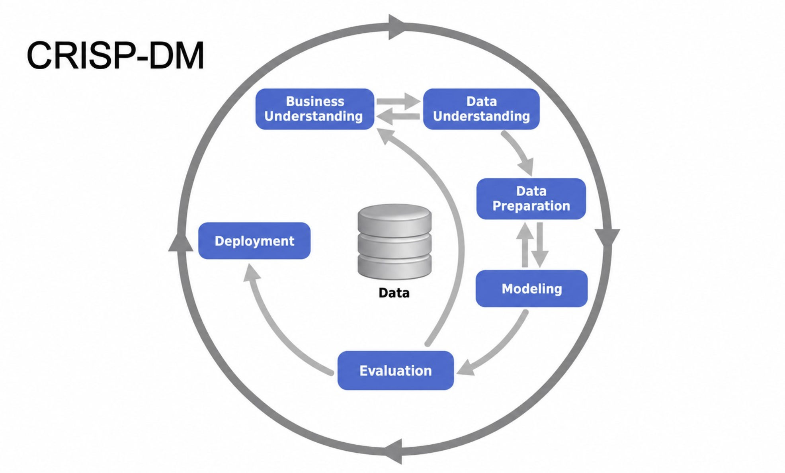

# ML Zoomcamp — Chapter 1: Introduction to Machine Learning

---

## 1.1 Introduction to Machine Learning

📺 [Video](https://www.youtube.com/watch?v=Crm_5n4mvmg&list=PL3MmuxUbc_hIhxl5Ji8t4O6lPAOpHaCLR&index=2) | 🖼️ [Slides](https://www.slideshare.net/AlexeyGrigorev/ml-zoomcamp-11-introduction-to-machine-learning)

### Core idea

The lesson explains ML using a **car price prediction** example.

- The model is trained on historical data made up of two parts:
  - **Features** — information about the object (e.g. `year`, `mileage`, `make`, `condition`, etc.)
  - **Target** — the property we want to predict (e.g. `price`)
- During training, the model **extracts patterns** from the features that explain the target.
- Once trained, the model is given **new data without the target**, and it uses the learned patterns to **predict** the target value.

> **ML = the process of extracting patterns from data**
> - **features** → input info about an object
> - **target** → the thing we want to predict for unseen objects

### Simple mental model

```
Training phase:
   [ Features + Target ]  --->  Model learns patterns

Prediction phase:
   [ Features only ]  --->  Trained Model  --->  Predicted Target
```

**Example — Car price prediction**

| year | mileage | make    | ... | price (target) |
|------|---------|---------|-----|-----------------|
| 2015 | 60,000  | Toyota  | ... | $12,000         |
| 2018 | 30,000  | Honda   | ... | $16,500         |
| 2020 | 10,000  | Ford    | ... | ?  ← model predicts this |

- Rows with a known `price` → used to **train** the model.
- New row without `price` → fed to the trained model to **predict** the price.

### Key takeaway

Machine Learning isn't about hard-coding rules — it's about letting a model **learn patterns from historical examples (features → target)** so it can make predictions on new, unseen data.

---

<!-- Next lesson notes (1.2 ML vs Rule-Based Systems) go below -->

---

## 1.2 ML vs Rule-Based Systems

📺 [Video](https://www.youtube.com/watch?v=CeukwyUdaz8&list=PL3MmuxUbc_hIhxl5Ji8t4O6lPAOpHaCLR&index=3) | 🖼️ [Slides](https://www.slideshare.net/AlexeyGrigorev/ml-zoomcamp-12-ml-vs-rulebased-systems)

### Core idea

Explained using a **spam filter** example.

- **Rule-based systems** flag spam using a fixed set of hand-written characteristics/keywords (e.g. "contains 'lottery'", "sender unknown", email length, etc.).
- Problem: spam patterns keep **changing over time**, so rules need constant updates → the codebase grows, becomes messy, and hard to maintain.
- **ML systems** solve this by learning the patterns from data instead of hard-coding them, so they adapt more easily.

### How ML replaces the rule-based spam filter — 3 steps

**1. Get data**
Use existing emails as examples:
- Emails in the **spam folder** → spam examples
- Emails in the **inbox** → non-spam examples

**2. Define and calculate features**
- The old rules (keywords, length, sender patterns, etc.) become a great **starting point for features**.
- Each email is **encoded** into feature values + a target value:
  - `target = 1` if from the spam folder
  - `target = 0` if from the inbox

**3. Train and use the model**
- An ML algorithm is trained on the encoded emails (features → target).
- The model doesn't output a hard yes/no — it outputs a **probability** that an email is spam.
- To turn that probability into an actual decision, you must pick a **threshold** (e.g. `probability > 0.5 → spam`).

### Rule-based vs ML — quick comparison

| Aspect                  | Rule-Based System                  | Machine Learning System              |
|-------------------------|-------------------------------------|----------------------------------------|
| Logic source            | Manually written rules             | Learned from data                     |
| Adapting to new patterns| Requires manual rule updates       | Retrain model on new data             |
| Maintainability         | Gets complex/messy as rules grow   | Scales better as data grows           |
| Output                  | Hard decision (yes/no)             | Probability → needs a threshold       |

### Simple flow

```
Emails (spam folder + inbox)
        │
        ▼
 Encode → features + target (1 = spam, 0 = not spam)
        │
        ▼
   Train ML model
        │
        ▼
 New email → model outputs P(spam)
        │
        ▼
 Apply threshold (e.g. > 0.5) → final decision: spam / not spam
```

### Key takeaway

ML systems replace brittle, manually-maintained rules with patterns **learned from labeled data (features → target)**, and produce **probabilities** rather than hard rules — which is why a **threshold** is needed to turn a prediction into a decision.

---

<!-- Next lesson notes (1.3 Supervised Machine Learning) go below -->

---

## 1.3 Supervised Machine Learning

📺 [Video](https://www.youtube.com/watch?v=j9kcEuGcC2Y&list=PL3MmuxUbc_hIhxl5Ji8t4O6lPAOpHaCLR&index=4) | 🖼️ [Slides](https://www.slideshare.net/AlexeyGrigorev/ml-zoomcamp-13-supervised-machine-learning)

### Core idea

In **Supervised Machine Learning (SML)**, every training example has **labels** (known targets) attached to its features. The model learns from these labeled examples and then predicts labels for new, unseen features.

- **Feature matrix (X)** — a table of observations/objects (rows) × features (columns).
- **Target variable (y)** — a vector holding the known target value for each row in `X`.
- The model is represented as a function **g** that takes `X` as input and tries to output predictions as close as possible to `y`.
- **Training** = the process of finding that function **g**.

```
        Feature matrix X                Target y
   ┌───────────────────────┐          ┌─────────┐
   │ year | mileage | make │          │  price  │
   │ 2015 |  60,000 |Toyota│   --->   │ 12,000  │
   │ 2018 |  30,000 | Honda│   --->   │ 16,500  │
   │ 2020 |  10,000 |  Ford│   --->   │ 21,000  │
   └───────────────────────┘          └─────────┘

              g(X) ≈ y   ← training finds this function g
```

### Types of SML problems

| Type              | Output                                   | Example                              |
|-------------------|-------------------------------------------|----------------------------------------|
| **Regression**     | A number                                  | Predicting a car's price               |
| **Classification** | A category                                | Spam detection                         |
| — Binary           | 2 categories                              | Spam vs. not spam                      |
| — Multiclass       | More than 2 categories                    | Classifying animal species             |
| **Ranking**        | Top scores associated with items          | Recommender systems (e.g. product/search ranking) |

### Key takeaway

SML is about teaching a model with labeled examples (features → known targets) so it can learn a function **g** that generalizes well — producing predictions on new data that are as close as possible to the true, unseen targets **y**.

---

<!-- Next lesson notes (1.4 CRISP-DM) go below -->

---

## 1.4 CRISP-DM

📺 [Video](https://www.youtube.com/watch?v=dCa3JvmJbr0&list=PL3MmuxUbc_hIhxl5Ji8t4O6lPAOpHaCLR&index=5) | 🖼️ [Slides](https://www.slideshare.net/AlexeyGrigorev/ml-zoomcamp-14-crispdm)

### Core idea

**CRISP-DM** = **Cr**oss-**I**ndustry **S**tandard **P**rocess for **D**ata **M**ining — an open, widely-used process model describing the common steps data mining/ML experts follow on a project. Conceived in 1996, it became a European Union ESPRIT project in 1997, led by five companies (ISL, Teradata, Daimler AG, NCR, and OHRA insurance).

### The 6 steps



```
1. Business Understanding
        │  (Do we even need ML? Define a measurable goal)
        ▼
2. Data Understanding
        │  (What data exists? Do we need more?)
        ▼
3. Data Preparation
        │  (Clean data, remove noise, build pipelines,
        │   convert to tabular format for ML)
        ▼
4. Modeling
        │  (Train multiple models, pick the best one —
        │   may loop back to fix data/add features)
        ▼
5. Evaluation
        │  (Does the model actually solve the business problem?)
        ▼
6. Deployment
        (Roll out to production for all users —
         often paired with "online evaluation")
```

| Step | Question it answers |
|------|----------------------|
| **1. Business Understanding** | Do we need ML for this? Is the goal measurable? |
| **2. Data Understanding** | What data do we have/need? |
| **3. Data Preparation** | Is the data clean and ML-ready (tabular)? |
| **4. Modeling** | Which model performs best? |
| **5. Evaluation** | Does it solve the actual business problem? |
| **6. Deployment** | Roll out to production; evaluate live (online evaluation) |

### Important notes

- Project **maintainability** matters — not just model performance.
- ML projects are **iterative**, not linear/one-shot:
  1. **Start simple**
  2. **Learn from feedback**
  3. **Improve**
- Evaluation and deployment often happen together in practice (**online evaluation** — testing the model with real users/traffic).

### Key takeaway

CRISP-DM gives ML projects a structured, repeatable lifecycle — from confirming ML is even needed, through data prep and modeling, to evaluation and deployment — with the understanding that you'll **loop back and iterate** rather than expect success on the first pass.

---

<!-- Next lesson notes (1.5 Model Selection Process) go below -->

---

## 1.5 Model Selection Process

📺 [Video](https://www.youtube.com/watch?v=OH_R0Sl9neM&list=PL3MmuxUbc_hIhxl5Ji8t4O6lPAOpHaCLR&index=6) | 🖼️ [Slides](https://www.slideshare.net/AlexeyGrigorev/ml-zoomcamp-15-model-selection-process)

### Core idea

There are many candidate models to choose from — **Logistic Regression**, **Decision Tree**, **Neural Network**, or others. The question is: **how do we pick the best one?**

### Train / Validate / Test

- The **validation dataset** is **not** used during training.
- Both training and validation sets have their own **feature matrix (X)** and **target vector (y)**.
- Process:
  1. Fit the model on the **training** data.
  2. Use it to **predict** y (probabilities) for the **validation** feature matrix.
  3. **Compare** predicted vs. actual y on the validation set to measure performance.

### The Multiple Comparisons Problem (MCP)

- Since model outputs are **probabilistic**, a model can get **lucky** on the validation set purely by chance and look better than it really is.
- This is the **Multiple Comparisons Problem** — testing many models increases the odds that one looks good just by luck.
- **Solution:** hold out a separate **test set** to confirm the "best" model really is the best, independent of the validation results used to pick it.

### The 6-step model selection process

```
1. Split data → Train (60%) | Validation (20%) | Test (20%)
2. Train the candidate models on the Training set
3. Evaluate all models on the Validation set
4. Select the best-performing model
5. Apply that best model to the Test set
6. Compare Validation performance vs. Test performance
```

| Step | Purpose |
|------|---------|
| 1. Split data | Typically 60% train / 20% validation / 20% test |
| 2. Train models | Fit each candidate model on training data |
| 3. Evaluate models | Score each model on the validation set |
| 4. Select best model | Pick the top performer from validation |
| 5. Test best model | Run it on the untouched test set |
| 6. Compare metrics | Validation vs. test performance should be close — confirms the choice wasn't just luck (guards against MCP) |

> 💡 **Tip:** After selecting the best model (step 4), you can **combine** the training + validation datasets into one larger training set, retrain the chosen model on it, and *then* evaluate on the test set.

### Key takeaway

Model selection isn't just "pick whichever model scores highest on one dataset" — a proper **train/validation/test split** protects against the Multiple Comparisons Problem and gives an honest, unbiased estimate of how the chosen model will perform on truly unseen data.

---

<!-- Next lesson notes (1.6 Setting up the Environment) go below -->