# 2.1 Car Price Prediction Project

**Chapter 2: Machine Learning for Regression**

- Lesson video: https://www.youtube.com/watch?v=vM3SqPNlStE&list=PL3MmuxUbc_hIhxl5Ji8t4O6lPAOpHaCLR&index=12
- Slides: https://www.slideshare.net/AlexeyGrigorev/ml-zoomcamp-21-car-price-prediction-project
- Course notes: https://github.com/DataTalksClub/machine-learning-zoomcamp/blob/main/02-regression/01-car-price-intro.md
- Dataset (Kaggle): https://www.kaggle.com/CooperUnion/cardataset
- Code and data: https://github.com/alexeygrigorev/mlbookcamp-code/tree/master/chapter-02-car-price

---

## 1. What is this project about?

We build a model that **predicts the price of a car** from its characteristics (make, model, year, engine power, fuel type, transmission, etc.).

Imagine a website where a user lists a car for sale. The site can suggest a fair price automatically. That suggestion comes from our model.

This is a **supervised learning** problem:

- We have historical data where the answer (the price) is already known.
- The model learns the relationship between car characteristics and price.
- Later we use it on new cars where the price is unknown.

Because the thing we predict is a **number** (price in dollars), this is a **regression** problem.

---

## 2. Project plan

| Step | What we do |
|------|-----------|
| 1 | Prepare the data and do Exploratory Data Analysis (EDA) |
| 2 | Use linear regression to predict price |
| 3 | Understand the internals of linear regression |
| 4 | Evaluate the model with RMSE |
| 5 | Feature engineering |
| 6 | Regularization |
| 7 | Use the model to make predictions |

Each step maps to the next lessons of chapter 2.

---

## 3. Key terms explained

**Regression**
A type of supervised learning where the target is a continuous number (price, temperature, salary). Compare with classification, where the target is a category (spam / not spam).

**Linear regression**
A model that predicts the target as a weighted sum of the features. In simple form:

```
price = w0 + w1 * year + w2 * horsepower + w3 * mileage + ...
```

The model learns the weights (`w0`, `w1`, ...) from the data.

**Features (X)**
The input columns used for prediction, such as year, engine HP, number of doors.

**Target (y)**
The value we want to predict. Here it is `MSRP` (Manufacturer's Suggested Retail Price).

**EDA (Exploratory Data Analysis)**
Looking at the data before modelling: checking columns, missing values, distributions, outliers, and relationships. It tells us how to clean the data and what to expect.

**RMSE (Root Mean Squared Error)**
A metric to measure how wrong the model is, in the same units as the target. Formula:

```
RMSE = sqrt( (1/n) * sum( (prediction_i - actual_i)^2 ) )
```

Lower is better. An RMSE of 3000 means predictions are typically off by roughly 3000 dollars.

**Feature engineering**
Creating new, more useful features from existing ones. Example: turn `year` into `age = 2017 - year`.

**Regularization**
A technique that stops the model weights from becoming too large. It reduces overfitting and keeps the model stable, especially when features are correlated.

**Overfitting**
When a model memorizes the training data (including noise) and performs badly on new data.

---

## 4. Setting up the environment

Install the libraries (run once in a terminal):

```
pip install numpy pandas matplotlib seaborn scikit-learn jupyter
```

Start Jupyter:

```
jupyter notebook
```

Create a new notebook and start with the imports:

```python
import pandas as pd
import numpy as np

import seaborn as sns
from matplotlib import pyplot as plt

%matplotlib inline
```

What each library does:

- `pandas`: tables (DataFrames), reading CSV files, cleaning data
- `numpy`: fast numerical arrays and math
- `matplotlib` and `seaborn`: plotting
- `%matplotlib inline`: show plots directly inside the notebook

---

## 5. Getting the dataset

Download the CSV file directly:

```
wget https://raw.githubusercontent.com/alexeygrigorev/mlbookcamp-code/master/chapter-02-car-price/data.csv
```

If `wget` is not available (for example on Windows), load it straight from the URL in Python:

```python
url = "https://raw.githubusercontent.com/alexeygrigorev/mlbookcamp-code/master/chapter-02-car-price/data.csv"
df = pd.read_csv(url)
```

Or, if you downloaded the file next to your notebook:

```python
df = pd.read_csv("data.csv")
```

---

## 6. First look at the data

```python
# Number of rows and columns
df.shape
```

```python
# First 5 rows
df.head()
```

```python
# Column names, data types, and non-null counts
df.info()
```

Expected columns in this dataset include:

- `Make`, `Model`, `Year`
- `Engine Fuel Type`, `Engine HP`, `Engine Cylinders`
- `Transmission Type`, `Driven_Wheels`, `Number of Doors`
- `Market Category`, `Vehicle Size`, `Vehicle Style`
- `highway MPG`, `city mpg`, `Popularity`
- `MSRP` (the target)

---

## 7. Key takeaways

- The goal is to predict car price (`MSRP`), which makes this a **regression** problem.
- The dataset comes from a Kaggle competition and has car characteristics as features.
- The plan: prepare data and EDA, linear regression, how it works internally, RMSE, feature engineering, regularization, and using the model.
- Tools used: `pandas`, `numpy`, `matplotlib`, `seaborn`, and later `scikit-learn`.

---

## 8. Navigation

- Previous: Chapter 1 intro
- Next: 2.2 Data preparation

# 2.2 Data Preparation

**Chapter 2: Machine Learning for Regression**

- Lesson video: https://www.youtube.com/watch?v=Kd74oR4QWGM&list=PL3MmuxUbc_hIhxl5Ji8t4O6lPAOpHaCLR&index=13
- Course notes: https://github.com/DataTalksClub/machine-learning-zoomcamp/blob/main/02-regression/02-data-preparation.md
- Dataset: https://github.com/alexeygrigorev/mlbookcamp-code/tree/master/chapter-02-car-price

---

## 1. Goal of this lesson

Before any modelling we need clean, consistent data. In this lesson we:

1. Download the car price dataset
2. Load it with pandas
3. Make the **column names** consistent (lowercase, no spaces)
4. Find the **string columns**
5. Make the **string values** consistent (lowercase, no spaces)

Inconsistent names and values cause bugs and make the code harder to write, so this small cleanup pays off for the rest of the chapter.

---

## 2. Terms explained

**DataFrame**
The main pandas table structure: rows and named columns, like a spreadsheet or SQL table in memory.

**Series**
A single column of a DataFrame (a labelled 1-D array).

**Index**
The labels of a Series or DataFrame. `df.columns` is also an Index object, holding the column names.

**dtype (data type)**
The type of values stored in a column, such as `int64`, `float64`, or `object`.

**object dtype**
How pandas stores strings. When a column loaded from a CSV has dtype `object`, it is effectively a text column.

**`.str` accessor**
A pandas namespace that lets you apply string functions (`lower`, `replace`, `strip`, ...) to a whole column at once, without writing a loop.

**Method chaining**
Calling several methods one after another on the result of the previous one, for example `.str.lower().str.replace(...)`.

**Boolean mask**
A True/False series used to filter data. Example: `df.dtypes == 'object'` gives True for every text column.

---

## 3. Getting the data

The dataset originates from Kaggle, but a copy is stored in the `mlbookcamp-code` repository. Download it with `wget`:

```python
data = 'https://raw.githubusercontent.com/alexeygrigorev/mlbookcamp-code/master/chapter-02-car-price/data.csv'
!wget $data
```

Notes:

- The `!` at the start runs a shell command from inside a Jupyter notebook.
- `$data` passes the Python variable into the shell command.
- The file `data.csv` is saved in the current working directory.
- If `wget` is not available (for example on Windows), skip the download and read directly from the URL: `pd.read_csv(data)`.

---

## 4. Loading the data

```python
import pandas as pd

df = pd.read_csv('data.csv')
```

`read_csv` reads the file and returns a DataFrame. Always look at the first rows right after loading:

```python
df.head()
```

You will see columns such as make, model, year, engine details, and **MSRP** (Manufacturer's Suggested Retail Price). MSRP is our **target**, the value we want to predict.

---

## 5. Making column names consistent

### The problem

The raw column names are inconsistent:

- Some have capital letters: `Make`, `Model`
- Some have spaces: `Engine Fuel Type`
- Some use underscores: `Driven_Wheels`

Spaces are the worst. You cannot use dot notation with them:

```python
# This is a syntax error
df.Transmission Type

# You are forced to use brackets instead
df['Transmission Type']
```

With clean names like `transmission_type`, you can write `df.transmission_type`.

### The fix

`df.columns` is an Index, and an Index supports the `.str` accessor, so we can transform all names at once:

```python
df.columns.str.lower()
```

Chain a second step to replace spaces with underscores:

```python
df.columns.str.lower().str.replace(' ', '_')
```

Result:

```
Index(['make', 'model', 'year', 'engine_fuel_type', 'engine_hp',
       'engine_cylinders', 'transmission_type', 'driven_wheels',
       'number_of_doors', 'market_category', 'vehicle_size', 'vehicle_style',
       'highway_mpg', 'city_mpg', 'popularity', 'msrp'],
      dtype='object')
```

### Important: save the result

The expression above only **returns** a new Index. The DataFrame is unchanged until you assign it back:

```python
df.columns = df.columns.str.lower().str.replace(' ', '_')
```

---

## 6. Finding the string columns

Values have the same inconsistency problem (for example `BMW` vs `bmw`, `MANUAL` vs `manual`). To clean them we first need to know which columns contain text, because string methods fail on numbers.

Check the data types:

```python
df.dtypes
```

Filter to the text columns using a boolean mask:

```python
df.dtypes[df.dtypes == 'object']
```

This returns a Series where the index holds the column names and the values are all `object`. We only need the names, so take the index and convert it to a list:

```python
strings = list(df.dtypes[df.dtypes == 'object'].index)
strings
```

Result:

```
['make',
 'model',
 'engine_fuel_type',
 'transmission_type',
 'driven_wheels',
 'market_category',
 'vehicle_size',
 'vehicle_style']
```

---

## 7. Normalizing the string values

Loop over the string columns and apply the same lowercase and underscore transformation. Assign the result back to the DataFrame:

```python
for col in strings:
    df[col] = df[col].str.lower().str.replace(' ', '_')
```

Check the result:

```python
df.head()
```

Now everything is lowercase and spaces inside values (for example `premium unleaded (required)`) become underscores.

---

## 8. Full code of the lesson in one place

```python
import pandas as pd

# 1. Load
data = 'https://raw.githubusercontent.com/alexeygrigorev/mlbookcamp-code/master/chapter-02-car-price/data.csv'
df = pd.read_csv(data)

# 2. Clean column names
df.columns = df.columns.str.lower().str.replace(' ', '_')

# 3. Find text columns
strings = list(df.dtypes[df.dtypes == 'object'].index)

# 4. Clean text values
for col in strings:
    df[col] = df[col].str.lower().str.replace(' ', '_')

df.head()
```

---

## 9. Pandas cheat sheet from this lesson

| Code | What it does |
|------|--------------|
| `pd.read_csv(path)` | Read a CSV file into a DataFrame |
| `df.head()` | Show the first 5 rows |
| `df.columns` | Get the column names |
| `df.columns.str.lower()` | Lowercase all column names |
| `df.columns.str.replace(' ', '_')` | Replace spaces with underscores |
| `df.dtypes` | Get the data type of every column |
| `df.index` | Get the row labels of the DataFrame |

---

## 10. Key takeaways

- Clean names and values early. It prevents annoying bugs later.
- Use lowercase and underscores everywhere (snake_case) so you can use dot notation.
- The `.str` accessor applies string operations to a whole column without loops.
- String operations return a new object. You must assign it back (`df[col] = ...`) to keep the change.
- In pandas, text columns have dtype `object`.
- Selecting columns by dtype is done with a boolean mask on `df.dtypes`.

---

## 11. Navigation

- Previous: 2.1 Car price prediction project
- Next: 2.3 Exploratory data analysis (EDA)

# 2.3 Exploratory Data Analysis (EDA)

**Chapter 2: Machine Learning for Regression**

- Lesson video: https://www.youtube.com/watch?v=k6k8sQ0GhPM&list=PL3MmuxUbc_hIhxl5Ji8t4O6lPAOpHaCLR&index=14
- Slides: https://www.slideshare.net/AlexeyGrigorev/ml-zoomcamp-2-slides
- Course notes: https://github.com/DataTalksClub/machine-learning-zoomcamp/blob/main/02-regression/03-eda.md
- Full notebook: https://github.com/alexeygrigorev/mlbookcamp-code/blob/master/chapter-02-car-price/02-carprice.ipynb

---

## 1. Goal of this lesson

EDA means looking carefully at the data **before** training a model. We want to know:

- What values do the columns contain?
- How many distinct values does each column have?
- What does the **target** (`msrp`) distribution look like?
- Are there **missing values**?

The most important finding in this lesson: the price distribution has a **long tail**, and we should fix that with a **log transformation** before modelling.

### Diagram: EDA workflow

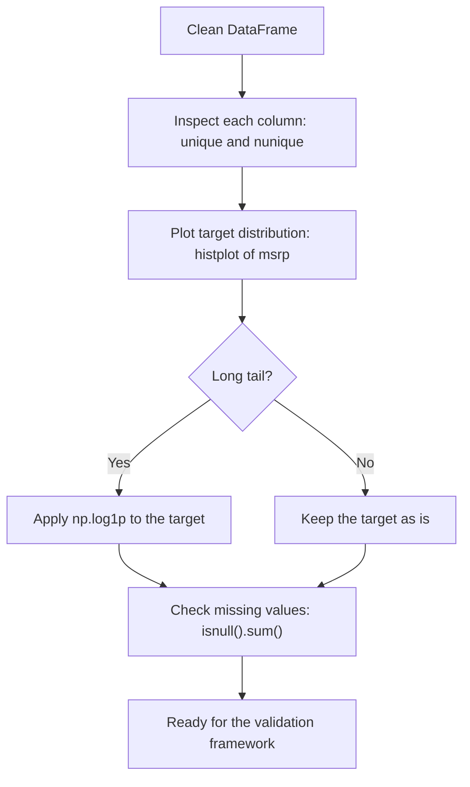

---

## 2. Terms explained

**EDA (Exploratory Data Analysis)**
Summarizing and visualizing a dataset to understand its structure, quality, and patterns before modelling.

**Target variable**
The value we want to predict. Here it is `msrp`.

**Distribution**
How the values of a variable are spread out: where most values lie, how spread out they are, and whether there are extreme values.

**Histogram**
A bar chart that groups values into ranges (bins) and shows how many observations fall in each bin.

**Long tail (skewed distribution)**
Most values are concentrated in a small range, but a few very large values stretch the distribution far to one side. Car prices are like this: most cars cost a few thousand to a few tens of thousands of dollars, while a few luxury cars cost over a million.

**Normal distribution**
The symmetric bell-shaped curve. Many ML models, linear regression included, work better when the target looks roughly like this.

**Log transformation**
Replacing each value `x` with `log(x)`. It compresses large values much more than small ones, so a long tail becomes a more symmetric shape.

**Null / missing value (NaN)**
An empty cell, meaning the value is unknown. We must detect these and deal with them before training.

**Bins**
The number of intervals a histogram uses. More bins give a more detailed picture.

---

## 3. Setup (from the previous lessons)

```python
import pandas as pd
import numpy as np

import seaborn as sns
from matplotlib import pyplot as plt

%matplotlib inline

df = pd.read_csv('data.csv')

df.columns = df.columns.str.lower().str.replace(' ', '_')

strings = list(df.dtypes[df.dtypes == 'object'].index)
for col in strings:
    df[col] = df[col].str.lower().str.replace(' ', '_')
```

`%matplotlib inline` makes sure plots are displayed inside the notebook cell.

---

## 4. Looking at each column

### Unique values and counts

For every column, look at a few unique values and how many there are in total:

```python
for col in df.columns:
    print(col)
    print(df[col].unique()[:5])
    print(df[col].nunique())
    print()
```

What the methods do:

- `df[col].unique()` returns an array of the distinct values in the column
- `[:5]` takes only the first 5 so the output stays readable
- `df[col].nunique()` returns the **number** of distinct values

Why this is useful:

- A column with very few unique values (for example `transmission_type`) is **categorical**.
- A column with many unique values (for example `msrp`, `popularity`) is **numerical**.
- Columns like `year` or `number_of_doors` are numbers but have few values. We will treat them carefully later.

---

## 5. Distribution of the target (price)

### Plot the histogram

```python
sns.histplot(df.msrp, bins=50)
```

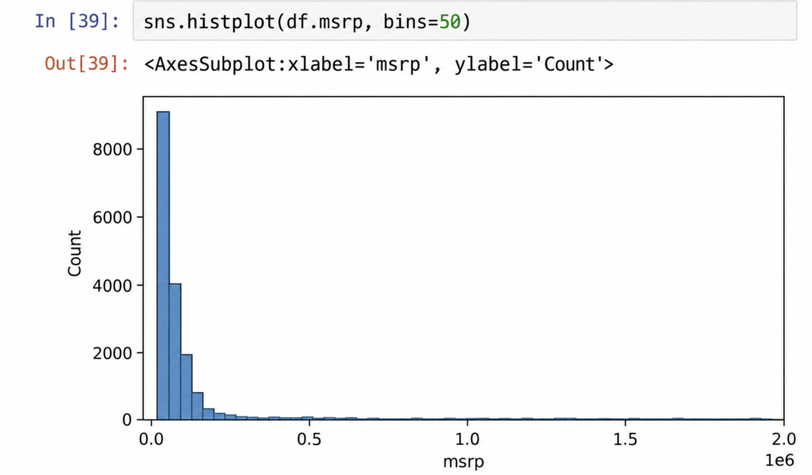

You will see a very tall bar at the left (cheap cars) and a thin line stretching far to the right (expensive cars). That is the **long tail**.

### Zoom into the main part

To see the bulk of the data more clearly, plot only cars below 100,000:

```python
sns.histplot(df.msrp[df.msrp < 100000], bins=50)
```
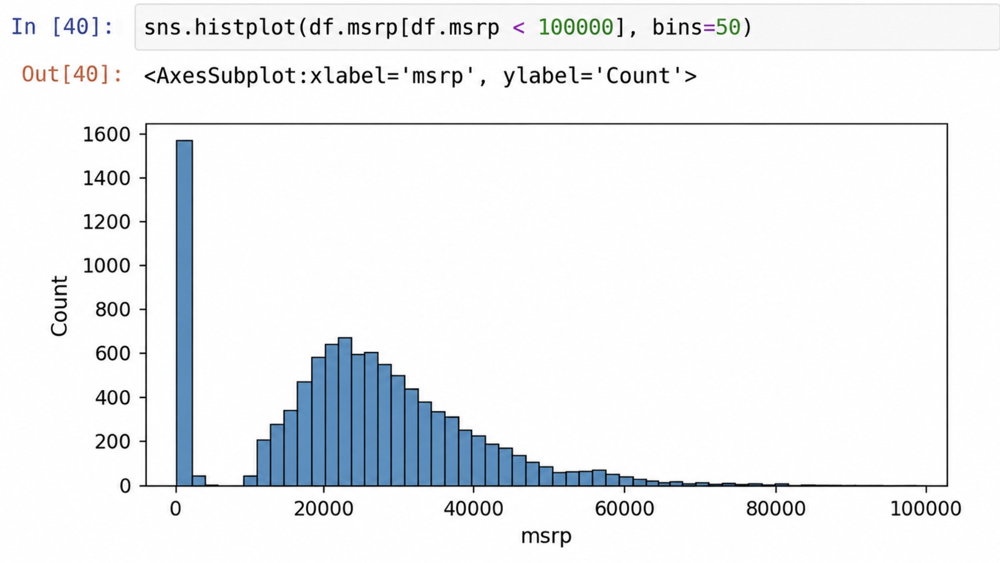


Even this zoomed view is still skewed and not a bell shape. The extreme values are the real problem, not just the way we plot.

### Why the long tail is a problem

- A few very expensive cars dominate the error calculation.
- The model tries hard to fit these rare values and does worse on the typical cars.
- Linear regression behaves better when the target is roughly normal.

---

## 6. Log transformation

Apply a logarithm to the price to squeeze the large values:

```python
price_logs = np.log(df.msrp)
```

Problem: `log(0)` is undefined. If any price is 0 this breaks. The safe approach is `log1p`, which computes `log(x + 1)`:

```python
price_logs = np.log1p(df.msrp)
```

Plot it:

```python
sns.histplot(price_logs, bins=50)
```

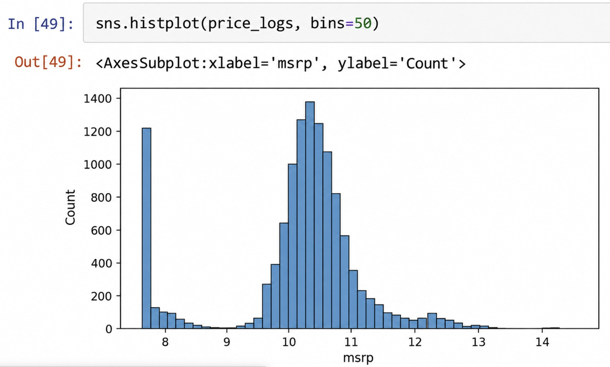

The long tail is gone and the shape is much closer to a normal bell curve.

### Diagram: effect of the log transformation

The image below uses **synthetic data** to illustrate the idea. Your real histogram of `msrp` will look similar in shape: a tall bar on the left and a thin tail to the right, which becomes a bell shape after `log1p`.

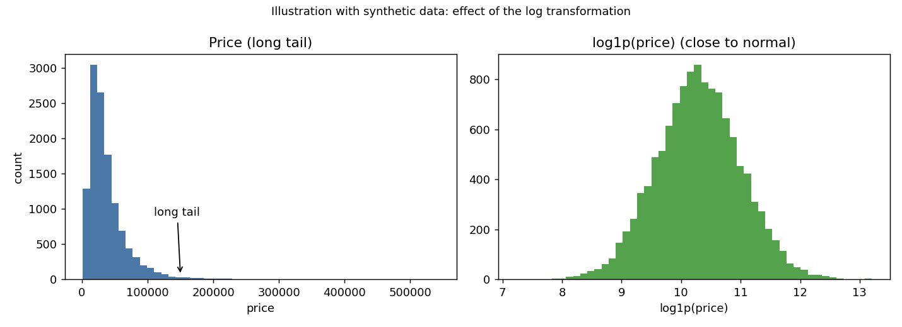

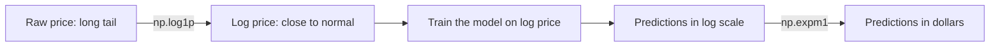

### Quick intuition

| Price | log1p(price) |
|-------|--------------|
| 1,000 | about 6.9 |
| 10,000 | about 9.2 |
| 100,000 | about 11.5 |
| 1,000,000 | about 13.8 |

A 1000x difference in price becomes only about a 7-point difference in log scale. Large values are compressed, small values are barely changed.

### Important for later

If we train the model on the **log price**, its predictions are also log prices. To get real dollars back, we reverse the transformation with `np.expm1()`:

```python
price = np.expm1(price_logs)
```

We will use this when we train and evaluate the model.

---

## 7. Missing values

Count the missing values per column:

```python
df.isnull().sum()
```

How it works:

- `df.isnull()` gives a table of True/False (True where the value is missing)
- `.sum()` adds up the True values per column, because True counts as 1

In this dataset a few columns have missing values (for example `engine_hp`, `engine_cylinders`, `number_of_doors`, `market_category`). We will handle them in the next lessons, since linear regression cannot work with NaN.

---

## 8. Cheat sheet from this lesson

| Code | What it does |
|------|--------------|
| `df[col].unique()` | Distinct values of a column |
| `df[col].nunique()` | Number of distinct values |
| `df.isnull().sum()` | Number of missing values per column |
| `sns.histplot(series, bins=50)` | Histogram of a series |
| `%matplotlib inline` | Show plots inside the notebook |
| `np.log1p(x)` | log(x + 1), safe log transform |
| `np.expm1(x)` | Inverse of log1p, back to the original scale |

---

## 9. Key takeaways

- Always do EDA before modelling. Look at values, unique counts, the target distribution, and missing values.
- Car prices have a **long tail**. This confuses many ML models.
- Apply **log1p** to the target to make its distribution closer to normal.
- Use `log1p` instead of `log` so a value of 0 does not break the code.
- Remember to convert predictions back with `expm1` when you need real prices.
- Check for missing values with `df.isnull().sum()`. We must deal with them before training.

---

## 10. Navigation

- Previous: 2.2 Data preparation
- Next: 2.4 Setting up the validation framework

# 2.4 Setting up the Validation Framework

**Chapter 2: Machine Learning for Regression**

- Lesson video: https://www.youtube.com/watch?v=ck0IfiPaQi0&list=PL3MmuxUbc_hIhxl5Ji8t4O6lPAOpHaCLR&index=15
- Course notes: https://github.com/DataTalksClub/machine-learning-zoomcamp/blob/main/02-regression/04-validation-framework.md

---

## 1. Goal of this lesson

The data is cleaned and explored. Before training anything, we split it into three parts and prepare the inputs and targets for each part. We do everything by hand with plain pandas and NumPy, with no ML library.

By the end we will have:

- `df_train`, `df_val`, `df_test`: the three feature tables
- `y_train`, `y_val`, `y_test`: the three target arrays (log of price)

### Diagram: lesson workflow

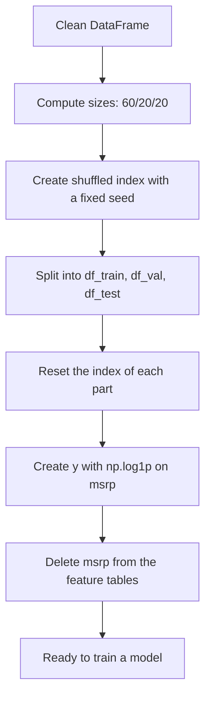

---

## 2. Terms explained

**Training set**
The data the model learns from. Biggest part (60%).

**Validation set**
Data the model does not train on. We use it to check how well the model works on unseen data and to compare different models or settings. We can look at it as often as we like.

**Test set**
Data kept aside until the very end. It gives a final, honest estimate of performance. We use it rarely, because every time we peek and adjust our model, it becomes a little less "unseen".

**Feature matrix (X)**
The table of input columns used to make predictions.

**Target (y)**
The value to predict. Here: the log of the car price.

**Generalization**
How well a model performs on data it has not seen. This is what we really care about, and why we validate.

**Data leakage**
When information that should not be available at prediction time gets into the features. If `msrp` stays in X, the model "predicts" the price using the price, and looks perfect for the wrong reason.

**Random seed**
A number that fixes the random generator, so the shuffle gives the same result every run. This makes experiments reproducible.

**Index (pandas)**
The row labels of a DataFrame. After shuffling, the labels are in random order and no longer run 0, 1, 2, ...

---

## 3. Why three parts?

If we trained and evaluated on the same data, a model could simply memorize the answers and look great while being useless on new cars. So we hold data back.

### Diagram: roles of the three parts

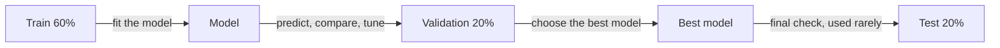

Each part gets its own X and y:

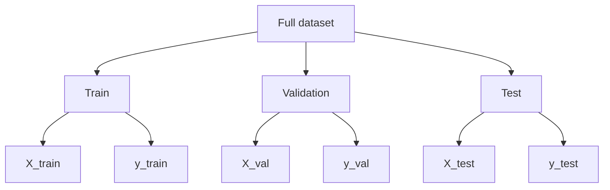

---

## 4. Calculating the sizes of the parts

We use a **60/20/20** split. The dataset has 11,914 rows, so 20% is about 2,382.8. We need whole numbers, so we cut the fraction with `int()`:

```python
n = len(df)

n_val = int(n * 0.2)
n_test = int(n * 0.2)
n_train = n - n_val - n_test
```

Why not `n_train = int(n * 0.6)`? Because of rounding, the three sizes might not add up to `n`, and we could silently drop a few rows. Taking validation and test first, and giving the rest to train, guarantees every row is used.

```python
n, n_val, n_test, n_train
```

Output:

```
(11914, 2382, 2382, 7150)
```

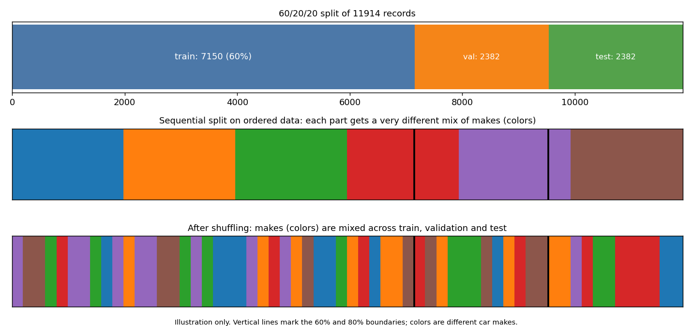

The picture is an illustration with made-up data. The top bar shows the real sizes.

---

## 5. Slicing a DataFrame with iloc

`iloc` selects rows by **position**. It accepts a single number, a list of numbers, or a slice:

```python
df.iloc[:10]     # rows 0 to 9 (end is not included)
df.iloc[10:20]   # rows 10 to 19
df.iloc[10:]     # row 10 until the end
```

The simplest split is sequential:

```python
df_val = df.iloc[:n_val]
df_test = df.iloc[n_val:n_val+n_test]
df_train = df.iloc[n_val+n_test:]
```

### The problem with a sequential split

In this dataset the rows are ordered (for example by car make). A sequential split puts a block of makes in validation and a different block in train. The parts then look very different from each other, which makes validation results misleading. Always **shuffle** first, so any accidental order in the data cannot affect the split.

---

## 6. Shuffling the records

`iloc` also accepts an arbitrary list of positions and returns rows in that order. So the idea is:

1. Make an array of positions `0 ... n-1`
2. Shuffle it
3. Take the first part for train, the next for validation, the rest for test

```python
import numpy as np

idx = np.arange(n)
np.random.shuffle(idx)
```

Then index with the shuffled positions:

```python
df_train = df.iloc[idx[:n_train]]
df_val = df.iloc[idx[n_train:n_train+n_val]]
df_test = df.iloc[idx[n_train+n_val:]]
```

### Make it reproducible

Without a seed, every run gives a different split, so your numbers will differ from run to run and from other people's. Set the seed **before** shuffling:

```python
np.random.seed(2)

idx = np.arange(n)
np.random.shuffle(idx)
```

With seed 2 and the same NumPy version, you should get the same subsets as the course.

### Diagram: shuffled split

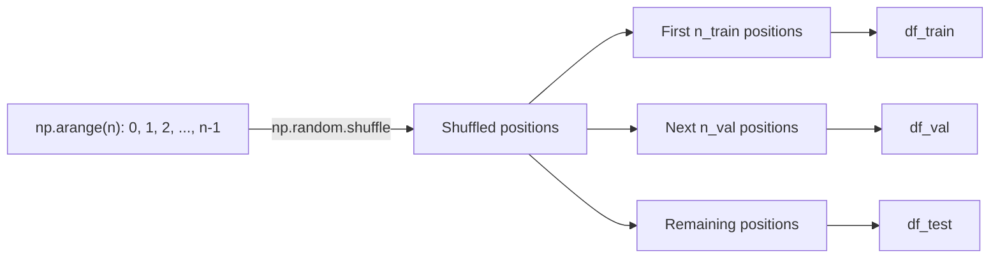

---

## 7. Resetting the index

Check the sizes:

```python
len(df_train), len(df_val), len(df_test)
```

Output:

```
(7150, 2382, 2382)
```

After shuffling, each DataFrame keeps its **original** row labels in random order (for example 2735, 6720, ...). We don't need them, so reset to 0, 1, 2, ... and assign the result back:

```python
df_train = df_train.reset_index(drop=True)
df_val = df_val.reset_index(drop=True)
df_test = df_test.reset_index(drop=True)
```

`drop=True` means "throw the old index away". Without it, the old labels would be added as a new column.

---

## 8. Preparing y and removing msrp

### Create the targets

We apply `log1p` because of the long tail (lesson 2.3). `.values` converts the pandas Series to a NumPy array, since we no longer need pandas features for y:

```python
y_train = np.log1p(df_train.msrp.values)
y_val = np.log1p(df_val.msrp.values)
y_test = np.log1p(df_test.msrp.values)
```

### Remove the target from the features

```python
del df_train['msrp']
del df_val['msrp']
del df_test['msrp']
```

Why delete it? To avoid **data leakage** by accident. If `msrp` is left among the features, the model uses the price to predict the price and looks perfect. You could waste a lot of time figuring out what went wrong.

### Diagram: what leakage looks like

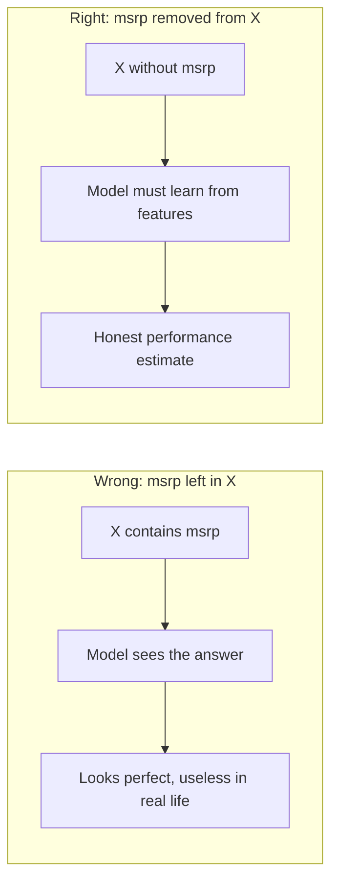

---

## 9. Full code of the lesson

```python
import numpy as np

# 1. Sizes
n = len(df)
n_val = int(n * 0.2)
n_test = int(n * 0.2)
n_train = n - n_val - n_test

# 2. Shuffle with a fixed seed
np.random.seed(2)
idx = np.arange(n)
np.random.shuffle(idx)

# 3. Split
df_train = df.iloc[idx[:n_train]]
df_val = df.iloc[idx[n_train:n_train+n_val]]
df_test = df.iloc[idx[n_train+n_val:]]

# 4. Reset the index
df_train = df_train.reset_index(drop=True)
df_val = df_val.reset_index(drop=True)
df_test = df_test.reset_index(drop=True)

# 5. Targets (log of price)
y_train = np.log1p(df_train.msrp.values)
y_val = np.log1p(df_val.msrp.values)
y_test = np.log1p(df_test.msrp.values)

# 6. Remove the target from the features
del df_train['msrp']
del df_val['msrp']
del df_test['msrp']
```

---

## 10. Cheat sheet from this lesson

**Pandas**

| Code | What it does |
|------|--------------|
| `df.iloc[a:b]` | Rows by position, from a up to b (b not included) |
| `df.iloc[list_of_positions]` | Rows in the order given by the list |
| `df.reset_index(drop=True)` | Renumber rows 0, 1, 2, ... and discard the old index |
| `df.col.values` | Convert a Series to a NumPy array |
| `del df['col']` | Remove a column in place |

**NumPy**

| Code | What it does |
|------|--------------|
| `np.arange(n)` | Array 0, 1, ..., n-1 |
| `np.random.shuffle(arr)` | Shuffle an array in place |
| `np.random.seed(k)` | Fix the random generator for reproducibility |
| `np.log1p(x)` | log(x + 1) |

---

## 11. Key takeaways

- Split the data into **train / validation / test** (60/20/20 here) before training.
- Train to learn, validation to compare and tune, test only at the very end.
- Give the **remainder** to train so rounding never drops rows.
- **Shuffle** before splitting, in case the data has an accidental order.
- Set a **random seed** so results are reproducible.
- Reset the index after shuffling, and take the target out as `y`.
- Apply `log1p` to the target, and **delete `msrp` from X** to avoid leakage.
- Predictions will be in log scale, so convert back with `np.expm1` when reporting prices in dollars.

---

## 12. Navigation

- Previous: 2.3 Exploratory data analysis
- Next: 2.5 Linear regression (simple version)

# 2.5 Linear Regression (Simple Version)

**Chapter 2: Machine Learning for Regression**

- Lesson video: https://www.youtube.com/watch?v=Dn1eTQLsOdA&list=PL3MmuxUbc_hIhxl5Ji8t4O6lPAOpHaCLR&index=16
- Course notes: https://github.com/DataTalksClub/machine-learning-zoomcamp/blob/main/02-regression/05-linear-regression-simple.md

---

## 1. Goal of this lesson

We look at **linear regression**, the model used to predict numbers such as car prices. In this lesson we:

1. Write the formula for **one car** (one row of data)
2. Implement it in Python with a simple loop
3. See what the final prediction is made of
4. Convert the prediction from log price back to dollars

The weights in this lesson are invented by us. Learning them from data comes in later lessons.

### Diagram: lesson flow

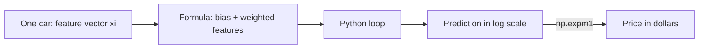

---

## 2. Terms explained

**Model (g)**
A function that takes features and returns a prediction. We write `g(X) ≈ y`: the model applied to the features should be close to the target.

**Observation**
One example, here one car. It corresponds to one row of the feature matrix.

**Feature vector (xi)**
The list of feature values for one car. `xi1` is the first feature of car number `i`, `xi2` the second, and so on.

**Weights (w1, w2, ...)**
One number per feature. A weight says how much that feature pushes the prediction up or down. A bigger weight means a stronger influence.

**Bias term (w0)**
The starting value of the prediction, used before looking at any feature. It is what we would predict for a car if we knew nothing about it.

**Linear**
The prediction is a plain weighted sum: each feature is multiplied by a number and the results are added. No squares, no products between features.

**Vector-vector multiplication (dot product)**
Multiply two lists element by element and add everything up. The sum in the formula is exactly this, which is why a compact vector form exists (next lesson).

**Inverse function**
A function that undoes another one. `np.expm1` undoes `np.log1p`.

---

## 3. The idea in one picture

### Diagram: how the model combines the features

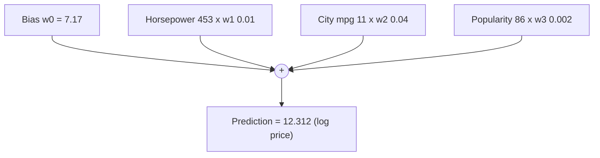

---

## 4. The formula for one car

For one car we write the feature vector as `xi`. Our example is row 10 of the training data, a Rolls-Royce Phantom Drophead Coupe from 2015. We use only three features:

- engine horsepower: 453
- city miles per gallon: 11
- popularity: 86 (number of mentions on Twitter)

```python
xi = [453, 11, 86]
```

The linear regression formula for this car:

$$g(x_i) = w_0 + w_1 \cdot x_{i1} + w_2 \cdot x_{i2} + w_3 \cdot x_{i3}$$

The same thing with a sum over the features (`j` goes from 1 to n, here n = 3):

$$g(x_i) = w_0 + \sum_{j=1}^{n} w_j \cdot x_{ij}$$

Reading it in words: start from the bias, then for every feature multiply it by its weight and add the result.

---

## 5. Implementing it in Python

Here are the parameters. These weights are made up for illustration:

```python
xi = [453, 11, 86]

w0 = 7.17
w = [0.01, 0.04, 0.002]
```

The function:

```python
def linear_regression(xi):
    n = len(xi)

    pred = w0

    for j in range(n):
        pred = pred + w[j] * xi[j]

    return pred
```

How it works:

- `pred` starts at the bias `w0`
- the loop visits each feature, multiplies it by its weight, and adds it to `pred`
- the math formula counts features from 1 to n, but Python counts from 0 to n-1, so `range(n)` is the right loop

Try it:

```python
linear_regression(xi)
```

Output:

```
12.312
```

---

## 6. What is the prediction made of?

The result is a sum of four parts:

```
7.17 + 453 * 0.01 + 11 * 0.04 + 86 * 0.002 = 12.312
```

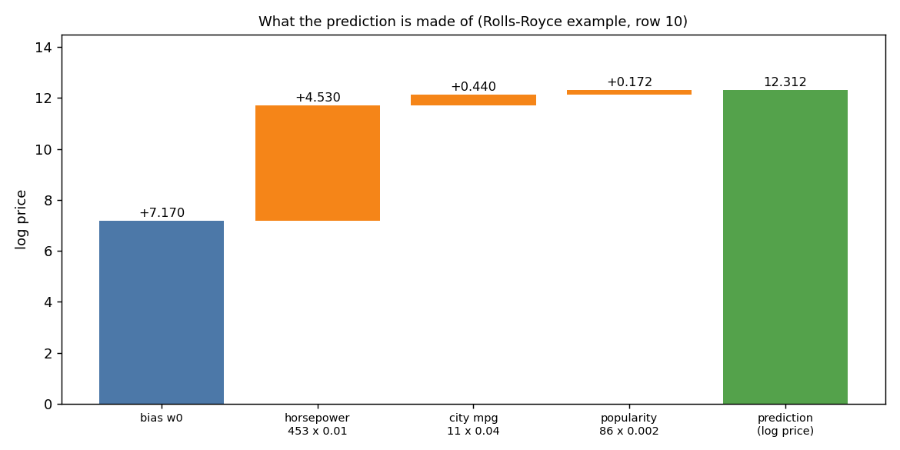

| Part | Calculation | Contribution | Meaning |
|------|-------------|--------------|---------|
| Bias | 7.17 | 7.170 | Prediction when we know nothing about the car |
| Horsepower | 453 x 0.01 | 4.530 | Each extra horsepower adds 0.01. More power, higher price |
| City mpg | 11 x 0.04 | 0.440 | Each extra unit adds 0.04. In this data, thirstier cars tend to be fancier |
| Popularity | 86 x 0.002 | 0.172 | Tiny weight, so it barely moves the price |

Notes on interpreting weights:

- A **positive** weight pushes the prediction up as the feature grows. A negative weight pushes it down.
- A weight only tells you about the relationship in the data. It does not prove that the feature causes the price.
- The size of a contribution depends on both the weight and the feature scale. Popularity has a small weight, but features with big values can still matter.

---

## 7. From log price back to dollars

The number 12.312 is **not** a price in dollars. In lesson 2.3 we trained on `np.log1p(msrp)`, so the model outputs a **log price**. To get dollars, apply the inverse function:

```python
import numpy as np

np.expm1(12.312)
```

Output:

```
222347.2221101062
```

So the predicted price is about 222,000 dollars.

`expm1` and `log1p` undo each other:

```python
np.log1p(222347.2221101062)
```

Output:

```
12.312
```

### Diagram: log scale and back

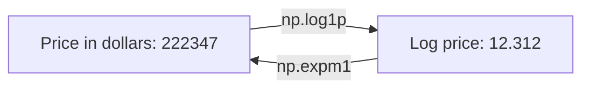

---

## 8. Compact vector form (preview of next lesson)

The sum over features is a **dot product** between the feature vector and the weight vector. So the formula can be written as:

$$g(x_i) = w_0 + x_i^T \cdot w$$

Where:

- `x_i^T` is the feature vector of car i
- `w` is the vector of weights
- the dot product multiplies matching elements and adds them up

The next lesson uses this form to predict for **all cars at once**, with no Python loop.

---

## 9. Full code of the lesson

```python
import numpy as np

xi = [453, 11, 86]

w0 = 7.17
w = [0.01, 0.04, 0.002]

def linear_regression(xi):
    n = len(xi)

    pred = w0

    for j in range(n):
        pred = pred + w[j] * xi[j]

    return pred

pred_log = linear_regression(xi)     # 12.312, in log scale
pred_price = np.expm1(pred_log)      # about 222347, in dollars

print(pred_log, pred_price)
```

---

## 10. Cheat sheet

| Symbol or code | Meaning |
|----------------|---------|
| `g(X) ≈ y` | Model applied to features should be close to the target |
| `xi` | Feature vector of one car |
| `w0` | Bias term |
| `w` | Weights, one per feature |
| `g(xi) = w0 + sum(wj * xij)` | Linear regression for one car |
| `np.expm1(x)` | Inverse of `np.log1p`, converts log price to price |

---

## 11. Key takeaways

- Linear regression predicts a number as **bias + weighted sum of the features**.
- Each weight tells how strongly one feature moves the prediction.
- The bias is the prediction when nothing is known about the car.
- For one car, the formula is a short Python loop over the features.
- Our model predicts **log price**, so we convert with `np.expm1` to get dollars.
- The weights here were made up. Finding good weights from data is the real training step, coming next.

---

## 12. Navigation

- Previous: 2.4 Setting up the validation framework
- Next: 2.6 Linear regression: vector form

# 2.6 Linear Regression: Vector Form

**Chapter 2: Machine Learning for Regression**

- Lesson video: https://www.youtube.com/watch?v=YkyevnYyAww&list=PL3MmuxUbc_hIhxl5Ji8t4O6lPAOpHaCLR&index=17
- Course notes: https://github.com/DataTalksClub/machine-learning-zoomcamp/blob/main/02-regression/06-linear-regression-vector.md

> Formula tip: every formula below is written twice, once as LaTeX (`$$` block) and once as plain text underneath. If your editor does not render math, the plain-text line still reads correctly.

---

## 1. Goal of this lesson

Last lesson we predicted the price of one car with a loop. Now we make it shorter and faster in three steps:

1. Recognize the sum as a **dot product**
2. Hide the bias term inside the dot product with a **fictional feature** that is always 1
3. Predict for **all cars at once** with a **matrix-vector multiplication**

### Diagram: from loop to matrix

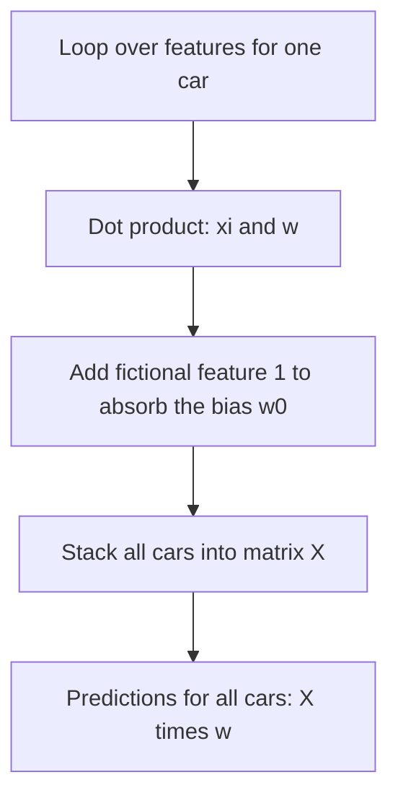

---

## 2. Terms explained

**Dot product**
Multiply two vectors element by element, then add the results. Two vectors of the same length give one number.

**Transpose (T)**
Flip a vector or matrix. In the formula `xi^T w`, the transpose is just the notation that says "dot product of xi and w". In NumPy code you do not need to transpose anything.

**Matrix**
A 2-D table of numbers. Our feature matrix `X` has one row per car and one column per feature.

**Matrix-vector multiplication**
Take each row of the matrix, do the dot product with the vector, and collect the results into a new vector. One result per row.

**Fictional (dummy) feature**
An extra feature `xi0` that equals 1 for every car. It exists only so the bias term can be treated like any other weight.

**Vectorization**
Replacing Python loops with matrix or vector operations. It is shorter, and NumPy runs it much faster.

**Shape**
The size of an array: `(rows, columns)`. Here `X` is (m cars, n+1 columns).

---

## 3. The dot product

Reminder from the last lesson, for one car:

$$
g(x_i) = w_0 + \sum_{j=1}^{n} x_{ij} \cdot w_j
$$

Plain text:

```
g(xi) = w0 + sum over j=1..n of ( xij * wj )
```

The sum is exactly a dot product between the feature vector and the weight vector. So we can write:

$$
g(x_i) = w_0 + x_i^T w
$$

Plain text:

```
g(xi) = w0 + dot(xi, w)
```

### Python: dot product by hand

```python
def dot(xi, w):
    n = len(xi)

    res = 0.0

    for j in range(n):
        res = res + xi[j] * w[j]

    return res
```

Now linear regression becomes very short:

```python
xi = [453, 11, 86]
w0 = 7.17
w = [0.01, 0.04, 0.002]

def linear_regression(xi):
    return w0 + dot(xi, w)
```

---

## 4. The fictional feature

The bias `w0` still sits alone, outside the dot product. The trick: pretend every car has an extra feature `xi0` that is always 1. Then both vectors get one more element at the front:

```
w  = [w0, w1, w2, ..., wn]       (n + 1 values)
xi = [1,  xi1, xi2, ..., xin]    (n + 1 values)
```

Why this works: in the dot product, `w0` is multiplied by 1, so it stays unchanged. The rest is the same sum as before. The result is identical, but the whole formula is now a single dot product:

$$
g(x_i) = x_i^T w
$$

Plain text:

```
g(xi) = dot(xi_with_leading_1, w_with_w0)
```

### Diagram: absorbing the bias

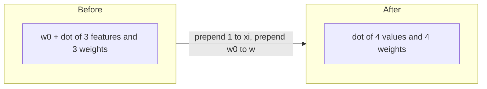

### Python: prepending with list concatenation

In Python, `[a] + list` creates a new list with `a` at the front:

```python
w_new = [w0] + w
w_new
```

Output:

```
[7.17, 0.01, 0.04, 0.002]
```

Same for the features:

```python
def linear_regression(xi):
    xi = [1] + xi
    return dot(xi, w_new)
```

Check:

```python
linear_regression([453, 11, 86])
```

Output:

```
12.312
```

This matches the result from lesson 2.5.

---

## 5. Linear regression for all cars

Now think about the whole dataset. Because of the fictional feature, every row of the feature matrix `X` starts with 1, followed by that car's features:

```
        bias  hp   mpg  popularity
X = [ [  1,  x11, x12, x13 ],     <- car 1
      [  1,  x21, x22, x23 ],     <- car 2
      ...
      [  1,  xm1, xm2, xm3 ] ]    <- car m
```

`X` has `m` rows (cars) and `n+1` columns (features plus the fictional one).

To predict, take every row, dot it with `w`, and collect the results. That is a **matrix-vector multiplication**:

$$
Xw \approx y
$$

Plain text:

```
X . w  ≈  y
```

### Diagram: what the multiplication does

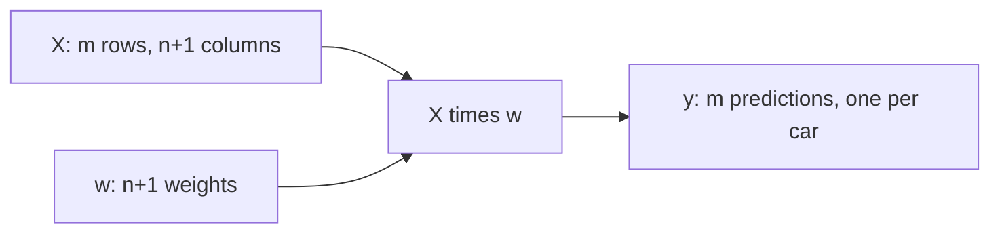

### Python: three cars

```python
import numpy as np

x1  = [1, 148, 24, 1385]
x2  = [1, 132, 25, 2031]
x10 = [1, 453, 11, 86]

X = [x1, x2, x10]
X = np.array(X)
X
```

Output:

```
array([[   1,  148,   24, 1385],
       [   1,  132,   25, 2031],
       [   1,  453,   11,   86]])
```

The weights are the same `w_new` as before:

```python
w0 = 7.17
w = [0.01, 0.04, 0.002]
w_new = [w0] + w
```

NumPy arrays have a `dot` method that does the whole multiplication in one line:

```python
def linear_regression(X):
    return X.dot(w_new)

linear_regression(X)
```

Output:

```
array([12.38 , 13.552, 12.312])
```

The third value is car number 10, the same 12.312 we got before. Each number is a **log price**, so convert to dollars with `np.expm1` when needed:

```python
np.expm1(linear_regression(X))
```

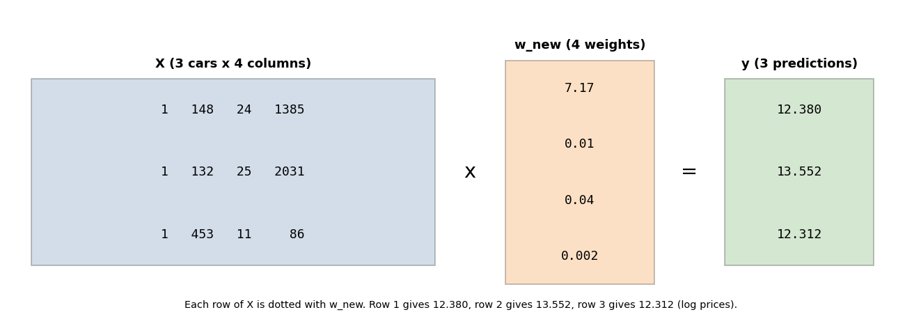

---

## 6. Shapes check

A quick way to avoid bugs is to check shapes:

```python
X.shape       # (3, 4): 3 cars, 4 columns (1 bias column + 3 features)
w_new         # 4 weights
X.dot(w_new)  # 3 predictions
```

Rule: the number of **columns** in `X` must equal the number of **weights**. The result has one value per **row**.

---

## 7. Full code of the lesson

```python
import numpy as np

w0 = 7.17
w = [0.01, 0.04, 0.002]
w_new = [w0] + w

# One car, using the dot product by hand
def dot(xi, w):
    n = len(xi)
    res = 0.0
    for j in range(n):
        res = res + xi[j] * w[j]
    return res

def linear_regression_one(xi):
    xi = [1] + xi
    return dot(xi, w_new)

print(linear_regression_one([453, 11, 86]))   # 12.312

# Many cars at once, using a matrix
X = np.array([
    [1, 148, 24, 1385],
    [1, 132, 25, 2031],
    [1, 453, 11, 86],
])

def linear_regression(X):
    return X.dot(w_new)

y_log = linear_regression(X)      # [12.38, 13.552, 12.312]
y_price = np.expm1(y_log)         # prices in dollars
print(y_log, y_price)
```

---

## 8. Cheat sheet

| Idea | Math | Code |
|------|------|------|
| One car, sum form | w0 + sum(xij * wj) | loop over features |
| One car, dot product | w0 + dot(xi, w) | `w0 + dot(xi, w)` |
| Fictional feature | xi0 = 1 | `[1] + xi` and `[w0] + w` |
| All cars | X times w | `X.dot(w_new)` |
| Back to dollars | inverse of log1p | `np.expm1(...)` |

---

## 9. Key takeaways

- The sum over features in linear regression is a **dot product**.
- Adding a **fictional feature equal to 1** lets the bias join the dot product, so the whole model is just `xi . w`.
- For the full dataset, linear regression is a **matrix-vector multiplication**: `X . w` gives one prediction per row.
- Vectorized NumPy code is shorter and much faster than Python loops.
- The model still predicts **log price**, so use `np.expm1` to get dollars.
- We still invented the weights. The next lesson shows how to compute them from data.

---

## 10. Navigation

- Previous: 2.5 Linear regression (simple version)
- Next: 2.7 Training a linear regression model