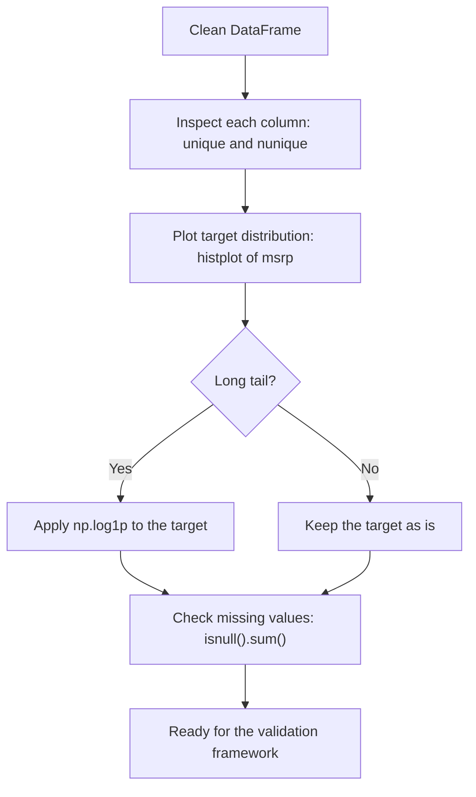
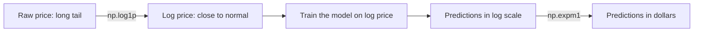

# 2.1 Car Price Prediction Project

**Chapter 2: Machine Learning for Regression**

- Lesson video: https://www.youtube.com/watch?v=vM3SqPNlStE&list=PL3MmuxUbc_hIhxl5Ji8t4O6lPAOpHaCLR&index=12
- Slides: https://www.slideshare.net/AlexeyGrigorev/ml-zoomcamp-21-car-price-prediction-project
- Course notes: https://github.com/DataTalksClub/machine-learning-zoomcamp/blob/main/02-regression/01-car-price-intro.md
- Dataset (Kaggle): https://www.kaggle.com/CooperUnion/cardataset
- Code and data: https://github.com/alexeygrigorev/mlbookcamp-code/tree/master/chapter-02-car-price

---

## 1. What is this project about?

We build a model that **predicts the price of a car** from its characteristics (make, model, year, engine power, fuel type, transmission, etc.).

Imagine a website where a user lists a car for sale. The site can suggest a fair price automatically. That suggestion comes from our model.

This is a **supervised learning** problem:

- We have historical data where the answer (the price) is already known.
- The model learns the relationship between car characteristics and price.
- Later we use it on new cars where the price is unknown.

Because the thing we predict is a **number** (price in dollars), this is a **regression** problem.

---

## 2. Project plan

| Step | What we do |
|------|-----------|
| 1 | Prepare the data and do Exploratory Data Analysis (EDA) |
| 2 | Use linear regression to predict price |
| 3 | Understand the internals of linear regression |
| 4 | Evaluate the model with RMSE |
| 5 | Feature engineering |
| 6 | Regularization |
| 7 | Use the model to make predictions |

Each step maps to the next lessons of chapter 2.

---

## 3. Key terms explained

**Regression**
A type of supervised learning where the target is a continuous number (price, temperature, salary). Compare with classification, where the target is a category (spam / not spam).

**Linear regression**
A model that predicts the target as a weighted sum of the features. In simple form:

```
price = w0 + w1 * year + w2 * horsepower + w3 * mileage + ...
```

The model learns the weights (`w0`, `w1`, ...) from the data.

**Features (X)**
The input columns used for prediction, such as year, engine HP, number of doors.

**Target (y)**
The value we want to predict. Here it is `MSRP` (Manufacturer's Suggested Retail Price).

**EDA (Exploratory Data Analysis)**
Looking at the data before modelling: checking columns, missing values, distributions, outliers, and relationships. It tells us how to clean the data and what to expect.

**RMSE (Root Mean Squared Error)**
A metric to measure how wrong the model is, in the same units as the target. Formula:

```
RMSE = sqrt( (1/n) * sum( (prediction_i - actual_i)^2 ) )
```

Lower is better. An RMSE of 3000 means predictions are typically off by roughly 3000 dollars.

**Feature engineering**
Creating new, more useful features from existing ones. Example: turn `year` into `age = 2017 - year`.

**Regularization**
A technique that stops the model weights from becoming too large. It reduces overfitting and keeps the model stable, especially when features are correlated.

**Overfitting**
When a model memorizes the training data (including noise) and performs badly on new data.

---

## 4. Setting up the environment

Install the libraries (run once in a terminal):

```
pip install numpy pandas matplotlib seaborn scikit-learn jupyter
```

Start Jupyter:

```
jupyter notebook
```

Create a new notebook and start with the imports:

```python
import pandas as pd
import numpy as np

import seaborn as sns
from matplotlib import pyplot as plt

%matplotlib inline
```

What each library does:

- `pandas`: tables (DataFrames), reading CSV files, cleaning data
- `numpy`: fast numerical arrays and math
- `matplotlib` and `seaborn`: plotting
- `%matplotlib inline`: show plots directly inside the notebook

---

## 5. Getting the dataset

Download the CSV file directly:

```
wget https://raw.githubusercontent.com/alexeygrigorev/mlbookcamp-code/master/chapter-02-car-price/data.csv
```

If `wget` is not available (for example on Windows), load it straight from the URL in Python:

```python
url = "https://raw.githubusercontent.com/alexeygrigorev/mlbookcamp-code/master/chapter-02-car-price/data.csv"
df = pd.read_csv(url)
```

Or, if you downloaded the file next to your notebook:

```python
df = pd.read_csv("data.csv")
```

---

## 6. First look at the data

```python
# Number of rows and columns
df.shape
```

```python
# First 5 rows
df.head()
```

```python
# Column names, data types, and non-null counts
df.info()
```

Expected columns in this dataset include:

- `Make`, `Model`, `Year`
- `Engine Fuel Type`, `Engine HP`, `Engine Cylinders`
- `Transmission Type`, `Driven_Wheels`, `Number of Doors`
- `Market Category`, `Vehicle Size`, `Vehicle Style`
- `highway MPG`, `city mpg`, `Popularity`
- `MSRP` (the target)

---

## 7. Key takeaways

- The goal is to predict car price (`MSRP`), which makes this a **regression** problem.
- The dataset comes from a Kaggle competition and has car characteristics as features.
- The plan: prepare data and EDA, linear regression, how it works internally, RMSE, feature engineering, regularization, and using the model.
- Tools used: `pandas`, `numpy`, `matplotlib`, `seaborn`, and later `scikit-learn`.

---

## 8. Navigation

- Previous: Chapter 1 intro
- Next: 2.2 Data preparation

# 2.2 Data Preparation

**Chapter 2: Machine Learning for Regression**

- Lesson video: https://www.youtube.com/watch?v=Kd74oR4QWGM&list=PL3MmuxUbc_hIhxl5Ji8t4O6lPAOpHaCLR&index=13
- Course notes: https://github.com/DataTalksClub/machine-learning-zoomcamp/blob/main/02-regression/02-data-preparation.md
- Dataset: https://github.com/alexeygrigorev/mlbookcamp-code/tree/master/chapter-02-car-price

---

## 1. Goal of this lesson

Before any modelling we need clean, consistent data. In this lesson we:

1. Download the car price dataset
2. Load it with pandas
3. Make the **column names** consistent (lowercase, no spaces)
4. Find the **string columns**
5. Make the **string values** consistent (lowercase, no spaces)

Inconsistent names and values cause bugs and make the code harder to write, so this small cleanup pays off for the rest of the chapter.

---

## 2. Terms explained

**DataFrame**
The main pandas table structure: rows and named columns, like a spreadsheet or SQL table in memory.

**Series**
A single column of a DataFrame (a labelled 1-D array).

**Index**
The labels of a Series or DataFrame. `df.columns` is also an Index object, holding the column names.

**dtype (data type)**
The type of values stored in a column, such as `int64`, `float64`, or `object`.

**object dtype**
How pandas stores strings. When a column loaded from a CSV has dtype `object`, it is effectively a text column.

**`.str` accessor**
A pandas namespace that lets you apply string functions (`lower`, `replace`, `strip`, ...) to a whole column at once, without writing a loop.

**Method chaining**
Calling several methods one after another on the result of the previous one, for example `.str.lower().str.replace(...)`.

**Boolean mask**
A True/False series used to filter data. Example: `df.dtypes == 'object'` gives True for every text column.

---

## 3. Getting the data

The dataset originates from Kaggle, but a copy is stored in the `mlbookcamp-code` repository. Download it with `wget`:

```python
data = 'https://raw.githubusercontent.com/alexeygrigorev/mlbookcamp-code/master/chapter-02-car-price/data.csv'
!wget $data
```

Notes:

- The `!` at the start runs a shell command from inside a Jupyter notebook.
- `$data` passes the Python variable into the shell command.
- The file `data.csv` is saved in the current working directory.
- If `wget` is not available (for example on Windows), skip the download and read directly from the URL: `pd.read_csv(data)`.

---

## 4. Loading the data

```python
import pandas as pd

df = pd.read_csv('data.csv')
```

`read_csv` reads the file and returns a DataFrame. Always look at the first rows right after loading:

```python
df.head()
```

You will see columns such as make, model, year, engine details, and **MSRP** (Manufacturer's Suggested Retail Price). MSRP is our **target**, the value we want to predict.

---

## 5. Making column names consistent

### The problem

The raw column names are inconsistent:

- Some have capital letters: `Make`, `Model`
- Some have spaces: `Engine Fuel Type`
- Some use underscores: `Driven_Wheels`

Spaces are the worst. You cannot use dot notation with them:

```python
# This is a syntax error
df.Transmission Type

# You are forced to use brackets instead
df['Transmission Type']
```

With clean names like `transmission_type`, you can write `df.transmission_type`.

### The fix

`df.columns` is an Index, and an Index supports the `.str` accessor, so we can transform all names at once:

```python
df.columns.str.lower()
```

Chain a second step to replace spaces with underscores:

```python
df.columns.str.lower().str.replace(' ', '_')
```

Result:

```
Index(['make', 'model', 'year', 'engine_fuel_type', 'engine_hp',
       'engine_cylinders', 'transmission_type', 'driven_wheels',
       'number_of_doors', 'market_category', 'vehicle_size', 'vehicle_style',
       'highway_mpg', 'city_mpg', 'popularity', 'msrp'],
      dtype='object')
```

### Important: save the result

The expression above only **returns** a new Index. The DataFrame is unchanged until you assign it back:

```python
df.columns = df.columns.str.lower().str.replace(' ', '_')
```

---

## 6. Finding the string columns

Values have the same inconsistency problem (for example `BMW` vs `bmw`, `MANUAL` vs `manual`). To clean them we first need to know which columns contain text, because string methods fail on numbers.

Check the data types:

```python
df.dtypes
```

Filter to the text columns using a boolean mask:

```python
df.dtypes[df.dtypes == 'object']
```

This returns a Series where the index holds the column names and the values are all `object`. We only need the names, so take the index and convert it to a list:

```python
strings = list(df.dtypes[df.dtypes == 'object'].index)
strings
```

Result:

```
['make',
 'model',
 'engine_fuel_type',
 'transmission_type',
 'driven_wheels',
 'market_category',
 'vehicle_size',
 'vehicle_style']
```

---

## 7. Normalizing the string values

Loop over the string columns and apply the same lowercase and underscore transformation. Assign the result back to the DataFrame:

```python
for col in strings:
    df[col] = df[col].str.lower().str.replace(' ', '_')
```

Check the result:

```python
df.head()
```

Now everything is lowercase and spaces inside values (for example `premium unleaded (required)`) become underscores.

---

## 8. Full code of the lesson in one place

```python
import pandas as pd

# 1. Load
data = 'https://raw.githubusercontent.com/alexeygrigorev/mlbookcamp-code/master/chapter-02-car-price/data.csv'
df = pd.read_csv(data)

# 2. Clean column names
df.columns = df.columns.str.lower().str.replace(' ', '_')

# 3. Find text columns
strings = list(df.dtypes[df.dtypes == 'object'].index)

# 4. Clean text values
for col in strings:
    df[col] = df[col].str.lower().str.replace(' ', '_')

df.head()
```

---

## 9. Pandas cheat sheet from this lesson

| Code | What it does |
|------|--------------|
| `pd.read_csv(path)` | Read a CSV file into a DataFrame |
| `df.head()` | Show the first 5 rows |
| `df.columns` | Get the column names |
| `df.columns.str.lower()` | Lowercase all column names |
| `df.columns.str.replace(' ', '_')` | Replace spaces with underscores |
| `df.dtypes` | Get the data type of every column |
| `df.index` | Get the row labels of the DataFrame |

---

## 10. Key takeaways

- Clean names and values early. It prevents annoying bugs later.
- Use lowercase and underscores everywhere (snake_case) so you can use dot notation.
- The `.str` accessor applies string operations to a whole column without loops.
- String operations return a new object. You must assign it back (`df[col] = ...`) to keep the change.
- In pandas, text columns have dtype `object`.
- Selecting columns by dtype is done with a boolean mask on `df.dtypes`.

---

## 11. Navigation

- Previous: 2.1 Car price prediction project
- Next: 2.3 Exploratory data analysis (EDA)

# 2.3 Exploratory Data Analysis (EDA)

**Chapter 2: Machine Learning for Regression**

- Lesson video: https://www.youtube.com/watch?v=k6k8sQ0GhPM&list=PL3MmuxUbc_hIhxl5Ji8t4O6lPAOpHaCLR&index=14
- Slides: https://www.slideshare.net/AlexeyGrigorev/ml-zoomcamp-2-slides
- Course notes: https://github.com/DataTalksClub/machine-learning-zoomcamp/blob/main/02-regression/03-eda.md
- Full notebook: https://github.com/alexeygrigorev/mlbookcamp-code/blob/master/chapter-02-car-price/02-carprice.ipynb

---

## 1. Goal of this lesson

EDA means looking carefully at the data **before** training a model. We want to know:

- What values do the columns contain?
- How many distinct values does each column have?
- What does the **target** (`msrp`) distribution look like?
- Are there **missing values**?

The most important finding in this lesson: the price distribution has a **long tail**, and we should fix that with a **log transformation** before modelling.

### Diagram: EDA workflow



---

## 2. Terms explained

**EDA (Exploratory Data Analysis)**
Summarizing and visualizing a dataset to understand its structure, quality, and patterns before modelling.

**Target variable**
The value we want to predict. Here it is `msrp`.

**Distribution**
How the values of a variable are spread out: where most values lie, how spread out they are, and whether there are extreme values.

**Histogram**
A bar chart that groups values into ranges (bins) and shows how many observations fall in each bin.

**Long tail (skewed distribution)**
Most values are concentrated in a small range, but a few very large values stretch the distribution far to one side. Car prices are like this: most cars cost a few thousand to a few tens of thousands of dollars, while a few luxury cars cost over a million.

**Normal distribution**
The symmetric bell-shaped curve. Many ML models, linear regression included, work better when the target looks roughly like this.

**Log transformation**
Replacing each value `x` with `log(x)`. It compresses large values much more than small ones, so a long tail becomes a more symmetric shape.

**Null / missing value (NaN)**
An empty cell, meaning the value is unknown. We must detect these and deal with them before training.

**Bins**
The number of intervals a histogram uses. More bins give a more detailed picture.

---

## 3. Setup (from the previous lessons)

```python
import pandas as pd
import numpy as np

import seaborn as sns
from matplotlib import pyplot as plt

%matplotlib inline

df = pd.read_csv('data.csv')

df.columns = df.columns.str.lower().str.replace(' ', '_')

strings = list(df.dtypes[df.dtypes == 'object'].index)
for col in strings:
    df[col] = df[col].str.lower().str.replace(' ', '_')
```

`%matplotlib inline` makes sure plots are displayed inside the notebook cell.

---

## 4. Looking at each column

### Unique values and counts

For every column, look at a few unique values and how many there are in total:

```python
for col in df.columns:
    print(col)
    print(df[col].unique()[:5])
    print(df[col].nunique())
    print()
```

What the methods do:

- `df[col].unique()` returns an array of the distinct values in the column
- `[:5]` takes only the first 5 so the output stays readable
- `df[col].nunique()` returns the **number** of distinct values

Why this is useful:

- A column with very few unique values (for example `transmission_type`) is **categorical**.
- A column with many unique values (for example `msrp`, `popularity`) is **numerical**.
- Columns like `year` or `number_of_doors` are numbers but have few values. We will treat them carefully later.

---

## 5. Distribution of the target (price)

### Plot the histogram

```python
sns.histplot(df.msrp, bins=50)
```


You will see a very tall bar at the left (cheap cars) and a thin line stretching far to the right (expensive cars). That is the **long tail**.

### Zoom into the main part

To see the bulk of the data more clearly, plot only cars below 100,000:

```python
sns.histplot(df.msrp[df.msrp < 100000], bins=50)
```


Even this zoomed view is still skewed and not a bell shape. The extreme values are the real problem, not just the way we plot.

### Why the long tail is a problem

- A few very expensive cars dominate the error calculation.
- The model tries hard to fit these rare values and does worse on the typical cars.
- Linear regression behaves better when the target is roughly normal.

---

## 6. Log transformation

Apply a logarithm to the price to squeeze the large values:

```python
price_logs = np.log(df.msrp)
```

Problem: `log(0)` is undefined. If any price is 0 this breaks. The safe approach is `log1p`, which computes `log(x + 1)`:

```python
price_logs = np.log1p(df.msrp)
```

Plot it:

```python
sns.histplot(price_logs, bins=50)
```


The long tail is gone and the shape is much closer to a normal bell curve.

### Diagram: effect of the log transformation

The image below uses **synthetic data** to illustrate the idea. Your real histogram of `msrp` will look similar in shape: a tall bar on the left and a thin tail to the right, which becomes a bell shape after `log1p`.




### Quick intuition

| Price | log1p(price) |
|-------|--------------|
| 1,000 | about 6.9 |
| 10,000 | about 9.2 |
| 100,000 | about 11.5 |
| 1,000,000 | about 13.8 |

A 1000x difference in price becomes only about a 7-point difference in log scale. Large values are compressed, small values are barely changed.

### Important for later

If we train the model on the **log price**, its predictions are also log prices. To get real dollars back, we reverse the transformation with `np.expm1()`:

```python
price = np.expm1(price_logs)
```

We will use this when we train and evaluate the model.

---

## 7. Missing values

Count the missing values per column:

```python
df.isnull().sum()
```

How it works:

- `df.isnull()` gives a table of True/False (True where the value is missing)
- `.sum()` adds up the True values per column, because True counts as 1

In this dataset a few columns have missing values (for example `engine_hp`, `engine_cylinders`, `number_of_doors`, `market_category`). We will handle them in the next lessons, since linear regression cannot work with NaN.

---

## 8. Cheat sheet from this lesson

| Code | What it does |
|------|--------------|
| `df[col].unique()` | Distinct values of a column |
| `df[col].nunique()` | Number of distinct values |
| `df.isnull().sum()` | Number of missing values per column |
| `sns.histplot(series, bins=50)` | Histogram of a series |
| `%matplotlib inline` | Show plots inside the notebook |
| `np.log1p(x)` | log(x + 1), safe log transform |
| `np.expm1(x)` | Inverse of log1p, back to the original scale |

---

## 9. Key takeaways

- Always do EDA before modelling. Look at values, unique counts, the target distribution, and missing values.
- Car prices have a **long tail**. This confuses many ML models.
- Apply **log1p** to the target to make its distribution closer to normal.
- Use `log1p` instead of `log` so a value of 0 does not break the code.
- Remember to convert predictions back with `expm1` when you need real prices.
- Check for missing values with `df.isnull().sum()`. We must deal with them before training.

---

## 10. Navigation

- Previous: 2.2 Data preparation
- Next: 2.4 Setting up the validation framework